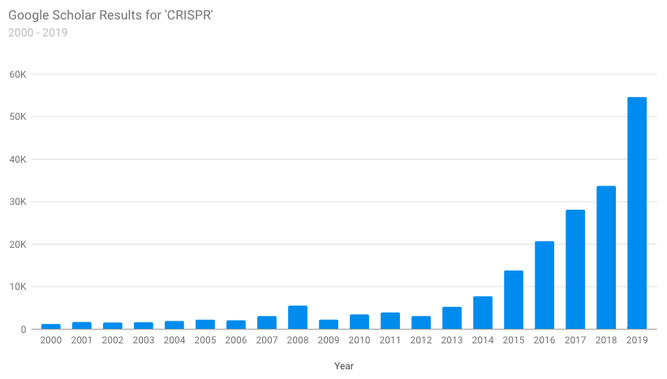
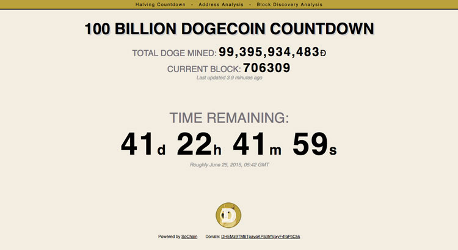
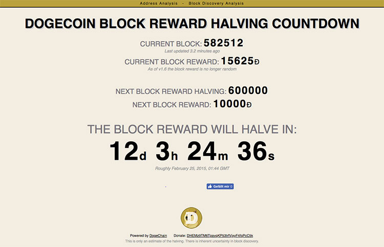

Add me on [LinkedIn](https://www.linkedin.com/in/csullender) and [GitHub](https://github.com/shiruken/). Check out my [websites](/websites).

# Texas COVID-19 Hospital Resource Usage

[covid-texas.csullender.com](https://covid-texas.csullender.com/) ([GitHub](https://github.com/shiruken/covid-texas))

Visualization of [Texas Department of State Health Services](https://www.dshs.state.tx.us/) data for regional hospital resource availability across the state. Highlights the impact COVID-19 hospitalizations are having on hospital bed and ICU bed usage. The raw data is extracted with Python using [pandas](https://pandas.pydata.org/). The website is built with [D3.js](https://d3js.org/) and deployed and hosted using [GitHub Pages](https://pages.github.com/).



# COVID-19 Case Map

[covid.csullender.com](https://covid.csullender.com/) ([GitHub](https://github.com/shiruken/covid))

Zoomable choropleth map of confirmed COVID-19 cases in the United States built with [D3.js](https://d3js.org/). Data sourced from the [COVID Tracking Project](https://covidtracking.com/) and [USAFacts](https://usafacts.org/visualizations/coronavirus-covid-19-spread-map/) and regularly updated using Python + [pandas](https://pandas.pydata.org/). The website is deployed and hosted using [GitHub Pages](https://pages.github.com/).



# Reddit r/science Dashboard

Monitors the [r/science community](https://www.reddit.com/r/science/) for all new submissions and tracks performance over the following 24 hours. Uses [PRAW](https://praw.readthedocs.io/) to grab various metrics and stores the results in a MySQL database. Charts are generated with [Google Charts](https://developers.google.com/chart) via server-side JSON exports and displayed on a website using Javascript + HTML.



# Scholar Plotr

[csullender.com/scholar](/scholar)

Scrapes Google Scholar search results to generate annual publication frequency charts for a specific query. Uses a combination of Javascript and Google Apps Script to overcome Google's anti-scraping protection. Dear Google, please please please implement an API for Google Scholar.

_**Note:** This tool is frequently nonfunctional thanks to Google rate-limiting and blocking my server._

# Bands I’ve Seen Live

[csullender.com/live-music](/live-music)

Lists every band I've seen perform live in concert. Uses the LastFM API to grab a photograph of the artist and displays in a simple grid generated using the CSS `flex` property.

# LastFM Listening History

[csullender.com/lastfm](/lastfm)

Uses the [LastFM](https://www.last.fm/) API and Python to scrape my weekly, yearly, and overall most listened-to artists, albums, and tracks. Loads and displays entries asynchronously using [jQuery](https://jquery.com/) and PHP.



# LastFM First Listen

[csullender.com/first](/first)

Input a [LastFM](https://www.last.fm/) username and an artist to get the first time the user ever scrobbled the artist and the name of the corresponding song. Implemented completely in PHP.

**Note:** This website no longer works since LastFM deprecated the _user.getArtistTracks_ API endpoint.

# The Last Swifting

[csullender.com/swifting](/swifting)

Input a [LastFM](https://www.last.fm/) username to see the last time the user listened to a Taylor Swift song (if ever). Results are asynchronously loaded using [jQuery](https://jquery.com/) and PHP.



# Fitbit History

[csullender.com/fitbit](/fitbit)

Uses the [Fitbit](https://www.fitbit.com/) API and Python to scrape my daily step count and sleep estimate to generate a dashboard-style website depicting a variety of statistics about my activity. Data is visualized using [Google Charts](https://developers.google.com/chart/).

# Trakt Viewing History

[csullender.com/trakt](/trakt)

Uses the [Trakt](https://trakt.tv/) and [TMDb](https://www.themoviedb.org/) APIs and Python to scrape my recently-viewed TV shows and movies and displays a list featuring episode stills and movie posters.

# Alabama Amendments Tweetbot

[@BamaAmendments](https://twitter.com/bamaamendments)

Uses the Twitter API and Python to post a daily tweet for each of the over 900 amendments to the 1901 Alabama Constitution.

# Twitter Analytics Dashboard

_Deprecated in November 2015_

Used the Twitter API + Python to reconstruct and maintain a clone of the downloadable Twitter archive. This collection of JSON files was parsed to extract a variety of metrics including monthly/hourly/weekly activity, user interaction frequency, tweet length distribution, and word frequency. The results of this analysis were presented on a dashboard-style website powered by of HTML, Javascript, and [Google Charts](https://developers.google.com/chart/).



# Dogecoin Address Analysis

[~~csullender.com/dogecoin/address.php~~](/dogecoin/address.php) (_Deprecated in September 2015_)

Loaded transaction data from [Dogechain](https://dogechain.info/) to generate a timeline and histogram of an individual Dogecoin address' balance over time. Powered by PHP and visualized with [Google Charts](https://developers.google.com/chart/).



# 100 Billion Dogecoin Countdown

[~~csullender.com/dogecoin~~](/dogecoin) (_Deprecated in June 2015_)

Estimated the time remaining until the 100 billionth Dogecoin was mined based on information from the [SoChain](https://chain.so/) API. Displayed as a Javascript countdown timer.

# Dogecoin Tweetbot

[~~@100BillionDoge~~](https://twitter.com/100BillionDoge) (_Deprecated in June 2015_)

Used the Twitter API and Python to tweet hourly updates about the remaining time until the each Dogecoin block reward halving and the mining of the 100 billionth Dogecoin.

# Dogecoin Halving Countdown

[~~csullender.com/dogecoin/halving.php~~](/dogecoin/halving.php) (_Deprecated in February 2015_)

Estimated the time remaining until the next Dogecoin block reward halving based on information from the [Dogechain](https://dogechain.info/) API. Displayed as a Javascript countdown timer.

# Dogecoin Block Discovery

[~~csullender.com/dogecoin/blocktime.php~~](/dogecoin/blocktime.php) (_Deprecated in December 2014_)

Used the [Dogechain](https://dogechain.info/) API and Python to scrape block timing information. Visualized the timeline and histogram of the Dogecoin block discovery times since inception using [Google Charts](https://developers.google.com/chart/).



# Destiny Countdown

_Deprecated in September 2014_

Javascript countdown to the release of Bungie's new game Destiny.

# Real-Time Location Tracker

_Deprecated in 2013_

Grabbed location information from a now-defunct Android location tracking app and displayed path on a dynamically updated Google Map along with current speed and total travel time and distance. Rendered obsolete by Google's _Share My Location_ and Apple's _Find My Friends_ features.