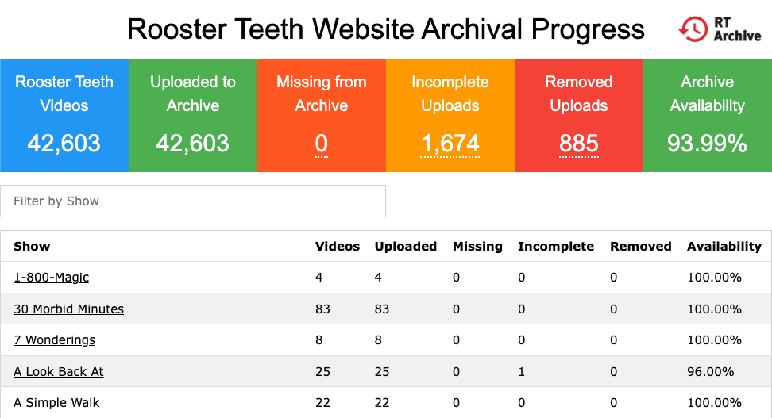
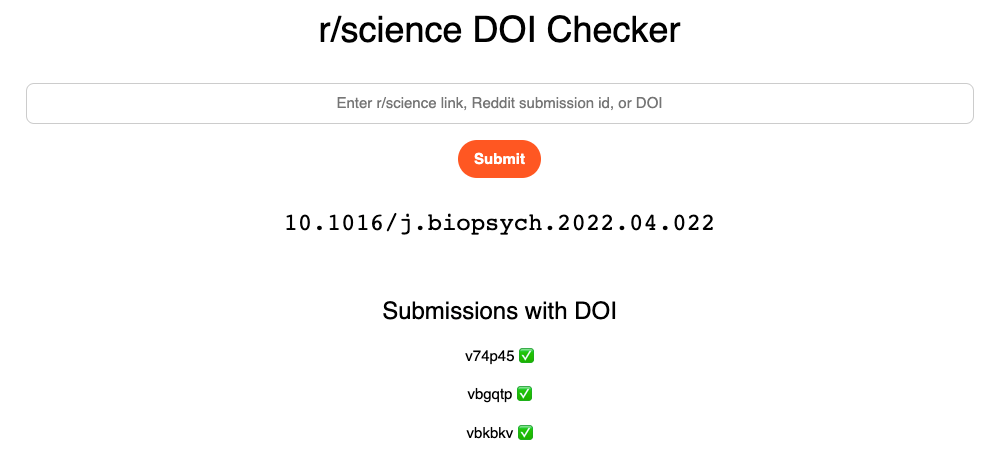
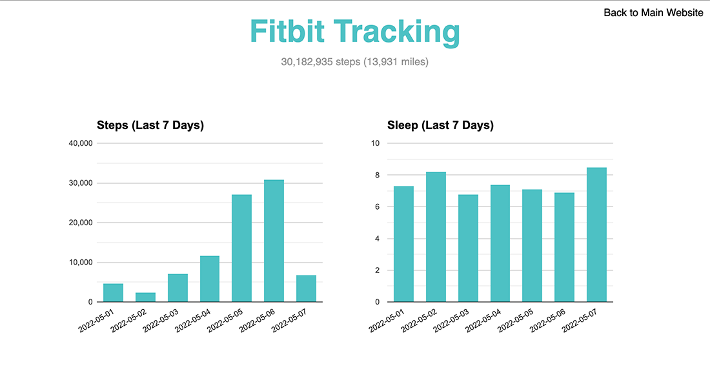
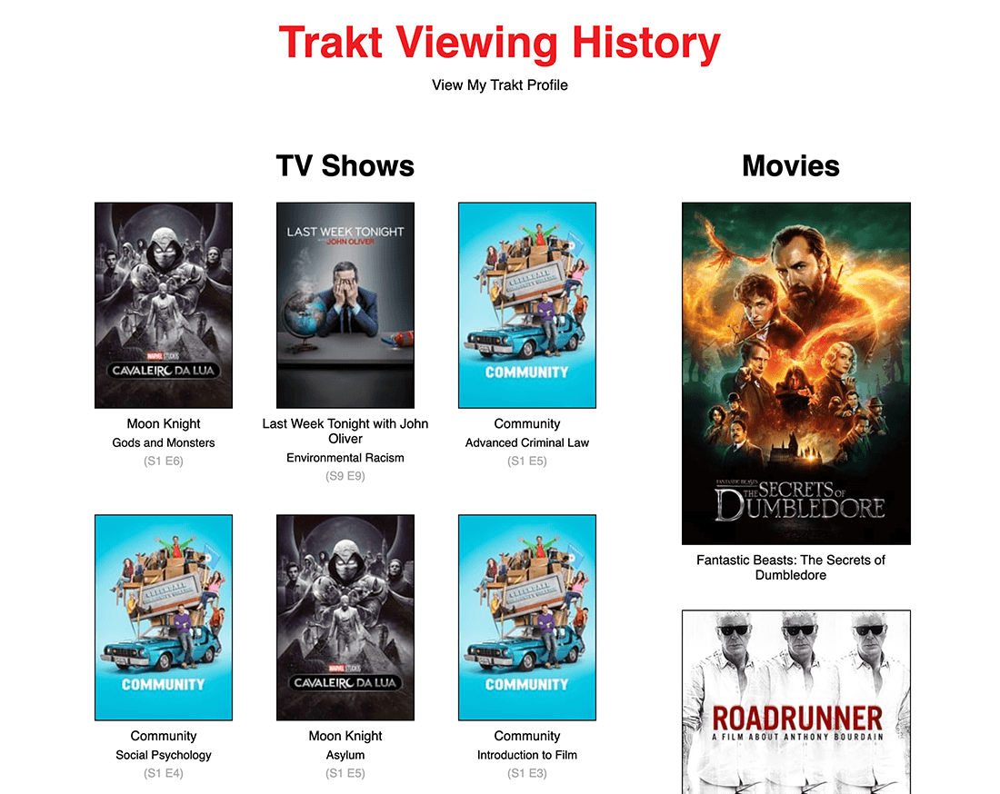

Add me on [LinkedIn](https://www.linkedin.com/in/csullender) and [GitHub](https://github.com/shiruken/). Check out my [websites](/websites).

# Reddit Developer Platform

Beta tester and developer on the [Reddit Developer Platform](https://developers.reddit.com/) (Devvit). I developed several utility apps to assist with common subreddit moderation tasks. All of the apps were written in [TypeScript](https://www.typescriptlang.org/) (my first experience with the language).

* [Admin Tattler](https://developers.reddit.com/apps/admin-tattler): Get notified when the Reddit Admins action content in your subreddit. [[Source](https://github.com/shiruken/admin-tattler)]
* [Moderator Mentions](https://developers.reddit.com/apps/mod-mentions): Get notified about moderator username mentions in your subreddit and (optionally) action the content. [[Source](https://github.com/shiruken/mod-mentions)]
* [Only Flairs](https://developers.reddit.com/apps/only-flairs): Easily restrict commenting on individual posts to only users flaired in your subreddit. [[Source](https://github.com/shiruken/only-flairs)]
* [User Scorer](https://developers.reddit.com/apps/user-scorer): Automatically report or remove comments from users based on their User Score, a metric quantifying their recent history in your subreddit. [[Source](https://github.com/shiruken/user-scorer/)]

# Rooster Teeth Website Archival Progress

[https://shiruken.github.io/rt-archive/](https://shiruken.github.io/rt-archive/) ([Source](https://github.com/shiruken/rt-archive))

Track the status of the [Rooster Teeth](https://en.wikipedia.org/wiki/Rooster_Teeth) website mirror on [Internet Archive](https://archive.org/details/roosterteetharchive?tab=collection&query=scanner%3Arooster&sort=-date). Originally created to monitor the progress of the [archival effort](https://archiveofpimps.com/) using the Rooster Teeth API. Tracks the completeness and availability of all 42,603 videos that were available on the platform prior to shutdown. Data processed and website generated with Python and hosted using [GitHub Pages](https://pages.github.com/).

# Reddit r/science DOI Checker

Automatic [digital object identifier (DOI)](https://en.wikipedia.org/wiki/Digital_object_identifier) lookup for posts on the [r/science community](https://www.reddit.com/r/science/) used to facilitate the moderation of reposts and other invalid submissions. Powered by [PRAW](https://praw.readthedocs.io/) using [Beautiful Soup](https://www.crummy.com/software/BeautifulSoup/) for parsing website content and [Flask](https://flask.palletsprojects.com/) for generating the frontend interface. Hosted using [Oracle Cloud Free Tier](https://www.oracle.com/cloud/free/).

# Texas COVID-19 Vaccine Tracker

[covid-texas.csullender.com/vaccine](https://covid-texas.csullender.com/vaccine/) ([Source](https://github.com/shiruken/covid-texas))

Visualization of county-level Texas COVID-19 vaccination data. Tracks the number of doses that have been allocated/shipped to providers and administered across the state. Data is scraped daily from the [Texas DSHS dashboard](https://tabexternal.dshs.texas.gov/#/site/THD/views/COVID%2d19VaccineinTexasDashboard/Summary) using Python with [pandas](https://pandas.pydata.org/) and accumulated into a time series. The website is built with [D3.js](https://d3js.org/) and deployed and hosted using [GitHub Pages](https://pages.github.com/).



# Texas COVID-19 Hospital Resource Usage

[covid-texas.csullender.com](https://covid-texas.csullender.com/) ([Source](https://github.com/shiruken/covid-texas))

Visualization of [Texas Department of State Health Services](https://www.dshs.state.tx.us/) data for regional hospital resource availability across the state. Highlights the impact COVID-19 hospitalizations are having on hospital bed and ICU bed usage. The raw data is extracted with Python using [pandas](https://pandas.pydata.org/). The website is built with [D3.js](https://d3js.org/) and deployed and hosted using [GitHub Pages](https://pages.github.com/).



# COVID-19 Case Map

[covid.csullender.com](https://covid.csullender.com/) ([Source](https://github.com/shiruken/covid))

Zoomable choropleth map of confirmed COVID-19 cases in the United States built with [D3.js](https://d3js.org/). Data sourced from the [COVID Tracking Project](https://covidtracking.com/) and [USAFacts](https://usafacts.org/visualizations/coronavirus-covid-19-spread-map/) and regularly updated using Python + [pandas](https://pandas.pydata.org/). The website is deployed and hosted using [GitHub Pages](https://pages.github.com/).



# Reddit r/science Dashboard

Monitors the [r/science community](https://www.reddit.com/r/science/) for all new submissions and tracks performance over the following 24 hours. Uses [PRAW](https://praw.readthedocs.io/) to grab various metrics and stores the results in a MySQL database. Charts are generated with [Google Charts](https://developers.google.com/chart) via server-side JSON exports and displayed on a website using Javascript + HTML.



# Scholar Plotr

_Deprecated in July 2022_

Scraped Google Scholar search results to generate annual publication frequency charts for a specific query. Used a combination of Javascript and Google Apps Scripts to overcome Google's anti-scraping protection. Dear Google, please please please implement an API for Google Scholar.

# Bands I’ve Seen Live

[csullender.com/live-music](/live-music)

Lists every band I've seen perform live in concert. Uses the LastFM API to grab a photograph of the artist and displays in a simple grid generated using the CSS `flex` property.

# LastFM Listening History

_Deprecated in July 2022_

Used the [LastFM](https://www.last.fm/) API and Python to scrape my weekly, yearly, and overall most listened-to artists, albums, and tracks. Loaded and displayed entries asynchronously using [jQuery](https://jquery.com/) and PHP.



# LastFM First Listen

_Deprecated in July 2022_

Input a [LastFM](https://www.last.fm/) username and an artist to get the first time the user ever scrobbled the artist and the name of the corresponding song. Implemented completely in PHP.

**Note:** This website no longer works since LastFM deprecated the _user.getArtistTracks_ API endpoint.

# The Last Swifting

_Deprecated in July 2022_

Input a [LastFM](https://www.last.fm/) username to see the last time the user listened to a Taylor Swift song (if ever). Results are asynchronously loaded using [jQuery](https://jquery.com/) and PHP.



# Fitbit History

_Deprecated in July 2022_

Used the [Fitbit](https://www.fitbit.com/) API and Python to ingest my daily step count and sleep estimates into a MySQL database in order to generate a dashboard website depicting a variety of statistics about my activity. Data was visualized using [Google Charts](https://developers.google.com/chart/).

# Trakt Viewing History

_Deprecated in July 2022_

Used the [Trakt](https://trakt.tv/) and [TMDb](https://www.themoviedb.org/) APIs and Python to scrape my recently-viewed TV shows and movies and displayed a list featuring episode stills and movie posters.

# Alabama Amendments Tweetbot

_Disabled in November 2020_

Uses the Twitter API and Python to post a daily tweet for each of the over 900 amendments to the 1901 Alabama Constitution.

# Twitter Analytics Dashboard

_Deprecated in November 2015_

Used the Twitter API + Python to reconstruct and maintain a clone of the downloadable Twitter archive. This collection of JSON files was parsed to extract a variety of metrics including monthly/hourly/weekly activity, user interaction frequency, tweet length distribution, and word frequency. The results of this analysis were presented on a dashboard-style website powered by of HTML, Javascript, and [Google Charts](https://developers.google.com/chart/).



# Dogecoin Address Analysis

_Deprecated in September 2015_

Loaded transaction data from [Dogechain](https://dogechain.info/) to generate a timeline and histogram of an individual Dogecoin address' balance over time. Powered by PHP and visualized with [Google Charts](https://developers.google.com/chart/).



# 100 Billion Dogecoin Countdown

_Deprecated in June 2015_

Estimated the time remaining until the 100 billionth Dogecoin was mined based on information from the [SoChain](https://chain.so/) API. Displayed as a Javascript countdown timer.

# Dogecoin Tweetbot

_Deprecated in June 2015_

Used the Twitter API and Python to tweet hourly updates about the remaining time until the each Dogecoin block reward halving and the mining of the 100 billionth Dogecoin.

# Dogecoin Halving Countdown

_Deprecated in February 2015_

Estimated the time remaining until the next Dogecoin block reward halving based on information from the [Dogechain](https://dogechain.info/) API. Displayed as a Javascript countdown timer.

# Dogecoin Block Discovery

_Deprecated in December 2014_

Used the [Dogechain](https://dogechain.info/) API and Python to scrape block timing information. Visualized the timeline and histogram of the Dogecoin block discovery times since inception using [Google Charts](https://developers.google.com/chart/).



# Destiny Countdown

_Deprecated in September 2014_

Javascript countdown to the release of Bungie's new game Destiny.

# Real-Time Location Tracker

_Deprecated in 2013_

Grabbed location information from a now-defunct Android location tracking app and displayed path on a dynamically updated Google Map along with current speed and total travel time and distance. Rendered obsolete by Google's _Share My Location_ and Apple's _Find My Friends_ features.