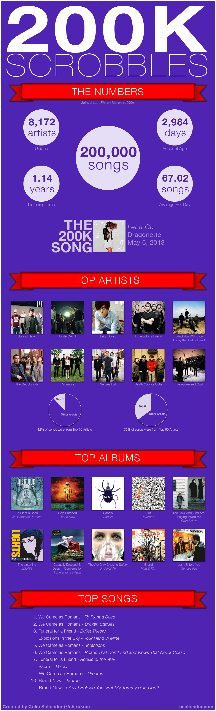

I recently surpassed the 200,000 song scrobble mark on [LastFM](http://www.last.fm/user/shiruken) since joining way back in March 2005. I threw together a little infographic summarizing my overall top artists, albums, and songs over the past 8+ years. I'm going to make a yearly summary so that all my charts aren't overwhelmed by the stuff I listened to back in high school. Click on the image for the full-sized infographic. Everything was created in Adobe Illustrator using information and images from the LastFM website.

