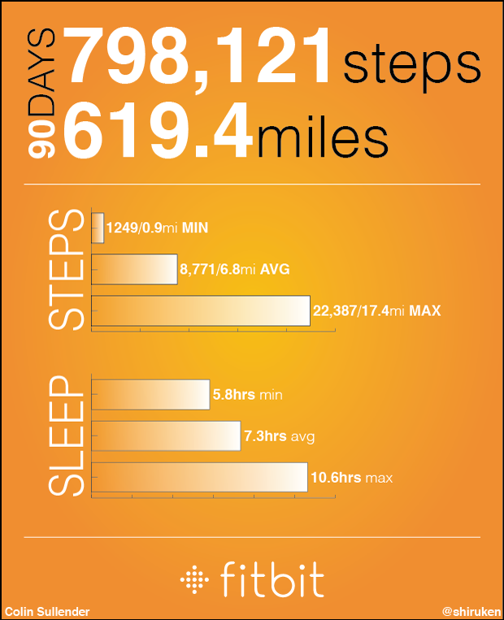
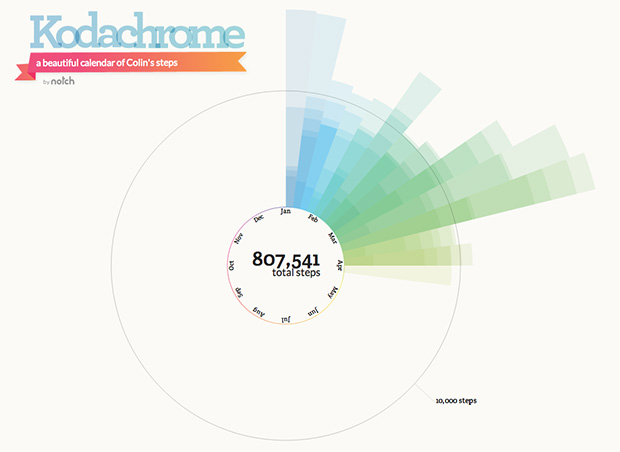

I bought myself a [Fitbit One](http://www.fitbit.com/one) right before the New Year in hopes of motivating more physical activity to offset my stationary lab lifestyle. It's been just over three months since I started tracking my daily steps and most of my sleep. While I haven't started running yet (I promise I'll start eventually), it's been fascinating to see my walking activity tracked throughout the day. One of my biggest complaints about Fitbit's services is that they make you pay to access in-depth information about your activity. I think that it's absolutely ludicrous to charge $49.99 a year to see the full extent of your data. With that said, they do offer an API for third-party development with access to the raw data (steps, distance, etc.) so I used this to [automatically pull](http://quantifiedself.com/2013/02/how-to-download-fitbit-data-using-google-spreadsheets/) my daily activity into a Google Drive spreadsheet for easy access and analysis. Using this data, I generate my ["health tracking" page](http://www.csullender.com/health/) featuring several charts of my ongoing Fitbit activity. The remainder of this post presents a summary of my Fitbit activity over the past 90 days since I got the One. 

The graph above depicts my daily step count for the past 90 days. The large increase in steps around Day 70 occurs during SXSW 2013 where I frequently walked over twice the 10,000 step daily goal. During this period, **I averaged 8,771 steps per day (6.8 miles)** with a maximum of 22,387 steps (17.4 miles) and a minimum of 1,249 steps (0.9 miles). **In total I took 798,121 steps for a total of 619.4 miles.** As far as I can tell, the pedometer is extremely reliable at counting steps and correctly ignoring movements that might be interpreted as a step. The stair-climbing count is a little less reliable and always seems to be much higher than I would have expected. The graphs below shows weekly averages for steps and distance. Once again, the massive spike in steps is the result of SXSW where I walked almost 100 miles over the course of the week.

The pie chart below shows my average activity breakdown throughout the course of a day. As I mentioned earlier, my status as a graduate student often results in my being stationary for (unhealthily/frustratingly) long periods of time. This is clearly seen in my abysmal activity report where my walks to/from the bus stop are the only source of "Very" and "Fairly" active ratings. A possible confounding factor is how exactly Fitbit counts time when in sleep tracking mode. If it is tracked as "sedentary," then this graph is misleading since about 7-8hrs of sleep are erroneously being included when it should only show activity whilst awake

And finally, what analytics report would be complete without some attempt at making an infographic? So here's a summary one that compiles some of the numbers reported above (and demonstrates my mediocre Illustrator skills). I've been quite happy with my Fitbit and once I actually start running again, it'll be even more useful for tracking activity in lieu of lugging around my smartphone while running. I can't say that I've made any conscious changes to my everyday activity since getting the One, but I definitely feel encouraged to walk more by knowing exactly how far I've walked each day. If that is enough to motivate/game-ify more physical activity from a user, then I think Fitbit has succeeded in their goal.

There are also several websites that can make infographics from your account data automatically. This one called [Kodachrome](http://notch.me/p/3VLnteBvoGwwT6lCBRqmSc) produces a really cool radar plot of the monthly activity.

