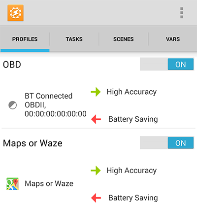
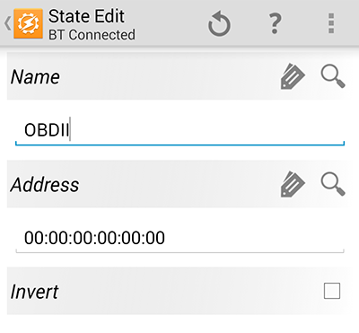
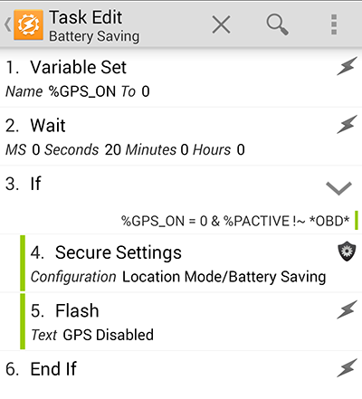

A few months ago I had [a blog post]( "Automatically Toggle 'High Accuracy' Location Mode on Android") about automatically toggling Android Location Mode on my smartphone between `High Accuracy` and `Battery Saving` when using certain apps. Using the super-app [Tasker](https://play.google.com/store/apps/details?id=net.dinglisch.android.taskerm) and a 3rd-party plugin called [Secure Settings](https://play.google.com/store/apps/details?id=com.intangibleobject.securesettings.plugin) I was able to swap the Location Mode of my Nexus 5 between the two modes. However, this was a poor solution since closing an app would result in disabling GPS access, which was undesirable if navigation was currently active. Furthermore, closing an app and returning to it would result in deactivation regardless of the timing. Despite numerous suggestions in the comments, none of them provided a viable answer. Since then, I purchased a [Bluetooth OBD](http://amzn.com/B005NLQAHS) (On-Board Diagnostic) tool to use with the very cool app [Dash](https://dash.by/). This device remains on at all times and the [Dash app](https://play.google.com/store/apps/details?id=com.dashlabs.dash.android&hl=en) is set to automatically connect whenever in range. This automatic connection via Bluetooth is what makes the following modifications to my automatic Location Mode toggling task possible. In practice, any automatically-connecting Bluetooth device in your car (or part of your car) could allow you to use this technique. **As before, you will need root access for Secure Settings to properly function.**

Two different profiles will be utilized: One that runs when certain apps are active and another that activates when a Bluetooth connection is established. Like before, I have selected Google Maps and Waze as triggers for enabling `High Accuracy` mode. The second profile is called **BT Connected** and triggers when a specific Bluetooth device connects. If you use the magnifying glass you can select from your list of authorized Bluetooth connections. In my case, I selected the OBD device called OBDII.

As before, we'll be using enter and exit tasks that run whenever either profile is triggered. The two tasks I used are linked here as Tasker XML files: [HighAccuracy.xml](https://drive.google.com/file/d/0Bx3p6yyQUcUITURpNzFJZllfcjQ/edit?usp=sharing) and [BatterySaving.xml](https://drive.google.com/file/d/0Bx3p6yyQUcUITFo2MVVSOHNwR3M/edit?usp=sharing). The first task enables High Accuracy mode whenever Google Maps or Waze opens or a Bluetooth connections is established with my car. The second task enables Battery Saving mode whenever those apps close or the Bluetooth connection disconnects. However, there is some fancy variable trickery that makes these two tasks work collectively.

As you can see in the task screenshots above, we are using a variable named `GPS_ON` to track the current state of high accuracy mode. By setting a delay on the battery saving task, we can allow the user to briefly leave the app and then return without changing location mode. I opted for a 20s delay but any amount of time can easily be used. The task will check the status of this flag and the status of the Bluetooth connection and proceed accordingly. In order for this to work properly, you'll need to disable "Enforce Task Order" for both profiles so that the flag can be triggered on/off during app switches. If all goes according to plan, then whenever Google Maps or Waze launches or your Bluetooth device connects, then `High Accuracy` mode will be enabled. Whenever those apps close or the Bluetooth device disconnects, then the Battery Saving task will execute. After waiting 20s, if those apps are not relaunched or Bluetooth device reconnected, then `Battery Saving` mode will be enabled. This allows the user to leave the GPS-requiring app for a short amount of time and return without toggling the location mode. When connected to the Bluetooth device (my car) it keeps the GPS enabled at all times for navigation purposes.

**Update:** _This process still appears to work on Android 5.0 "Lollipop" as long as you are using the [latest version of chainfire's SuperSU](http://www.chainfire.eu/)._