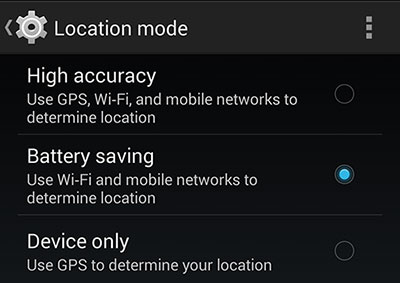
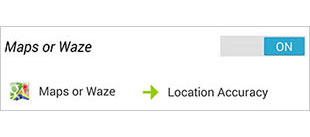

[**Check out this blog post for an updated Android Location Mode toggling task**]( "Automatic Android Location Mode Toggling 2.0")

One of Android's most innovative features is [Google Now](http://www.google.com/landing/now/), a service that attempts to provide relevant information to the user based on location and time. Unfortunately, in order to utilize the location-based service, your smartphone must provide location information to Google at expense of battery life. When Android 4.4 "Kitkat" was released in late October, the location settings were updated to include three different modes: High accuracy, battery saving, and device only. The 'high accuracy' mode utilizes GPS, Wi-Fi, and mobile networks to determine location, 'battery saving' only uses Wi-Fi and mobile networks, and 'device only' relies exclusively on GPS.

Needless to say, the use of GPS results in a much faster battery drain, especially when constantly reporting location to Google. For the most part, the 'battery saving' option is more than sufficient for the Google Now service and offers a reduction in battery consumption. However, if you try to use Google Maps navigation while in the battery saving mode, the location accuracy is usually insufficient for reliable directions. The only resolution for this is to manually navigate to the location settings and selecting the high accuracy mode. Once done with navigation, you have to again go to settings and re-enable the battery saving mode. This all feels very unnecessary and could easily be resolved if Maps had the ability to automatically enable and disable GPS. In lieu of an official update to achieve this, the powerhouse app [Tasker](https://play.google.com/store/apps/details?id=net.dinglisch.android.taskerm) once again steps up. Whenever you launch Maps (or any other app of your choice) the location settings will automatically be toggled to the "high accuracy" mode. Once you're done with the app it will revert back to "battery saving" mode.

In order to control the location mode settings, you'll need to install a Tasker plugin called [Secure Settings](https://play.google.com/store/apps/details?id=com.intangibleobject.securesettings.plugin). This app requires root access and lets you manipulate a handful of settings normally unavailable for Tasker control. For example, if you're running Android 4.4 and want to use Airplane Mode in a task, you have to use Secure Settings. You'll need to initialize the "Secure Helper" in the app to gain full functionality. Once you have Tasker and Secure Settings installed, then we can begin setting up the desired task.

In Tasker, create a new Profile using the `Application` option. Select the Google Maps app and return to the main screen. Follow the prompt to create a new task and name it accordingly. Enter the edit mode for the task and add a `Plugin > Secure Settings`. Press the edit button for `Configuration` and scroll down to the `GPS` option. Select the `ON` radio button and then save the setting. Unless you want to add an alert (notification, flash, etc.) to the task, it is now complete. Tasker automatically handles toggling off a setting if it is set to only run in certain apps. If everything is set properly, then whenever you launch Google Maps it should automatically swap to the 'high accuracy' mode which corresponds with GPS On in Secure Settings. You can check this by opening the location settings and verifying that it correctly set. When you close Maps, it should swap back to the "battery saving" mode which is the GPS Off state in Secure Settings.

