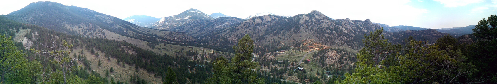
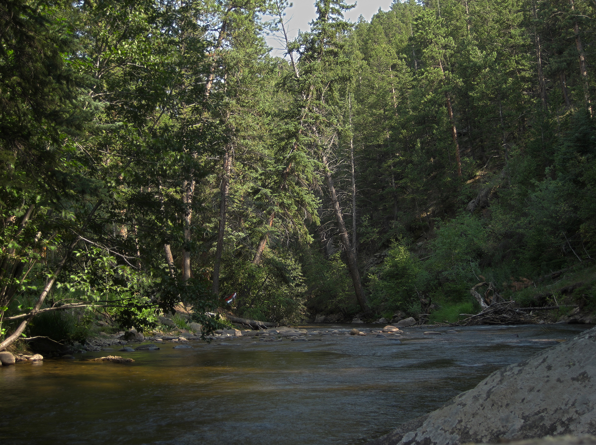
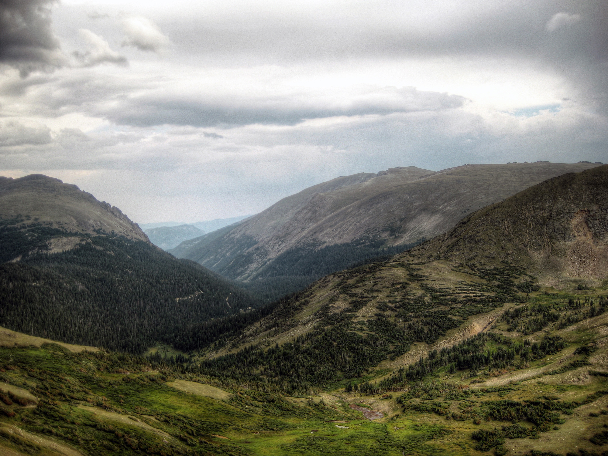

I recently visited Estes Park, Colorado where my dad has moved/semi-retired and took a ton of pictures since it's absolutely beautiful up there. Here are a select few with [many more available](https://www.flickr.com/photos/shiruken/sets/72157631087676880/) on my Flickr account. Sadly there was almost no snow in the park, which is apparently very unusual (thanks a lot global warming). Hopefully I'll be able to visit again around Christmas so there should be plenty of that annoying white precipitation on the ground. 

