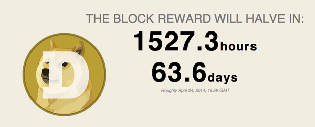

The first block reward halving for [Dogecoin](http://dogecoin.com/) resulted in many [Reddit users](http://www.reddit.com/r/dogecoin/) asking when the event was occurring and how much the new block reward would be. I haven't been able to find a good countdown website so I decided to throw one together myself. It uses the [DogeChain](http://dogechain.info/chain/Dogecoin) API to grab the current block number and estimates the time until the next change in the block reward. Since the Dogecoin [protocol](https://bitcointalk.org/index.php?PHPSESSID=7fsbe1l362dulhpb5an0j4imq0&topic=361813.msg3872945#msg3872945) establishes the specific block rewards, it's relatively simple to calculate it with some accuracy. Check it out by [clicking here](/dogecoin/halving.php)!

For those that care, the block reward is reported as the average rather than the range it actually occupies. For example, the first set of rewards ranged from 0 - 1,000,000 but is displayed as 500,000 for simplicity. The date estimate is calculated by finding the difference between the current block and the next block reward change. Since the block time for Dogecoin is 60s, it's quite easy to estimate when the next block reward halving will occur.

Since the next halving is over two months away, just bookmark the website so you can refer to it when everyone starts caring again. ~~I might even get around to adding a cheesy Javascript countdown to the page as well.~~

Tips: [DHEMz9TM6TpavqKP53trfVjxyF4fqPcC5k](dogecoin:DHEMz9TM6TpavqKP53trfVjxyF4fqPcC5k)