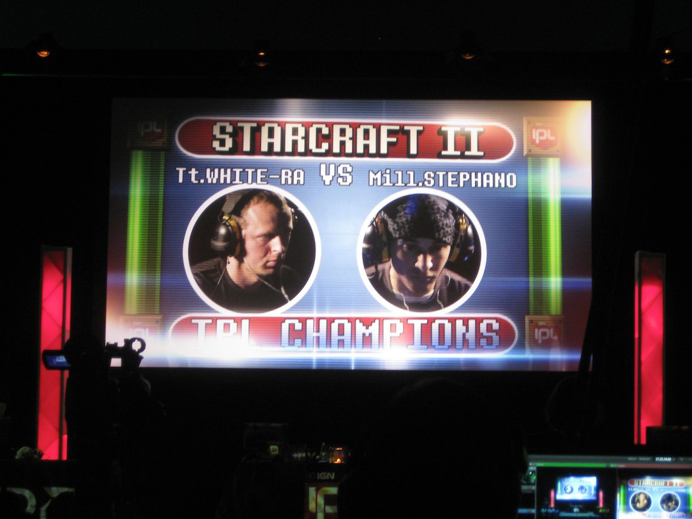
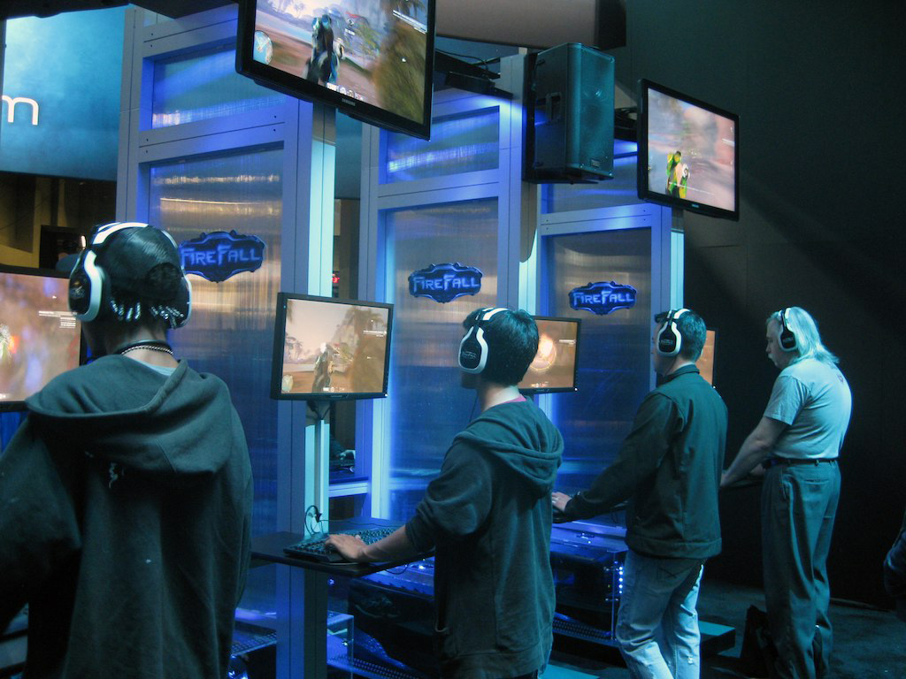

I went to my first SXSW event this past Saturday (despite the absolute deluge of rain) at the Palmer Event Center for the [Screenburn Arcade](http://sxsw.com/interactive/screenburn) where the IGN Pro League was putting on a StarCraft 2 showmatch between two community-voted players. Interestingly enough, the players Millenium.Stephano and TteSports.WhiteRa ended up being the winners of the IPL StarLeagues 2 and 3, respectively, which made the match feel even more epic. The Frenchman, Ilyes "Stephano" Satouri, is arguably the best foreigner (non-Korean) player in the world and definitely one of the best Zerg players globally. Aleksey "White-Ra" Krupnyk, hails from the Ukraine, and has been a long-time community favorite for his Protoss "special tactics" and broken English phrases that are frequently absorbed into the StarCraft eSports lexicon. It was awesome seeing these people play in person after being limited to [TwitchTV](http://twitch.tv) streams and [Major League Gaming](http://www.majorleaguegaming.com/) events in the past. Nothing beats a live crowd, especially when an [Archon Toilet](http://wiki.teamliquid.net/starcraft2/Archon_toilet) results in the nearly instantaneous death of 10+ Brood Lords and a complete change in momentum.

The Screenburn Arcade also had a handful of game companies present showing off games and selling merchandise. A FPS game called FireFall was featured prominently with an extensive demo area and tons of swag being given away. I played a round and somehow managed to go 24-0 (ZOMG SO 1337) despite not having played a PC shooter in years. Alienware also had a tournament area setup but I never had a chance to check out the game being played.

I doubt any of the other events that I'll be attending this week during SXSW will match the expansiveness of Screenburn, but I guess we'll see. If you're interested, [check out some more photos](https://www.flickr.com/photos/shiruken/albums/72157629198795286).