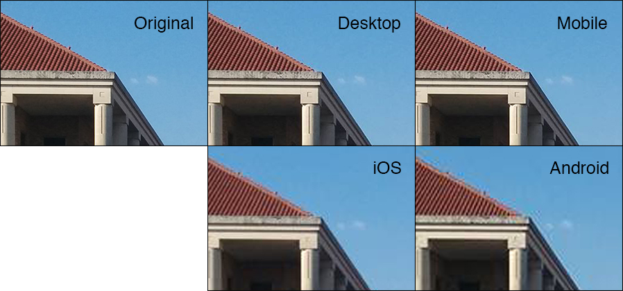



A couple weeks ago there was a [Reddit post on /r/Android](https://www.reddit.com/r/android/comments/3mjxz8/tip_if_uploading_images_to_facebook_use/) recommending Facebook users upload photos via the [mobile website](http://m.facebook.com) rather than the official Android Facebook app. The app reportedly compressed an original 8MP (4.5MB) photo to only 0.6MP (100kB) whereas the mobile website uploaded at 3MP (440kB). For a typical 4:3 ratio photograph, 0.6MP works out to neither dimension having more than 1000 pixels! Viewers on almost all current smartphones and tablets would be looking at an image smaller than their screen size. For a social network so heavily driven by photographs, you would think Facebook would do a better job maintaining some modicum of image quality. Most users probably have no idea their images are being so heavily degraded by uploading via the app. This blog examines the varying quality of Facebook image uploads in an attempt to identify the best option if you must upload to Facebook.

In order to compare image quality, I'm going to use two original photos and upload them to Facebook via the desktop browser, mobile browser, iOS app, and Android app. The first image was taken on my Nexus 5 smartphone at its full 8MP resolution (3264x2448, 1.1MB).

The second image was [borrowed from the ESL Flickr account](https://www.flickr.com/photos/eslphotos) and was taken with a Canon EOS 5D Mark III at a much larger 18MP (5196x3465, 21.4MB). This professional quality photo will hopefully highlight the worst case in terms of image compression.

Each image was uploaded to Facebook separately via the desktop browser, mobile browser, iOS app, and Android app. The uploaded/compressed images were then downloaded back onto my computer via the Theater view (`Options > Download`) for analysis. The resulting image dimensions and file sizes are summarized in the table below.

# Facebook Image Upload Compression Summary

There is clearly enormous file size compression and reduction in image resolution occurring via both the Android and iOS app uploads. Surprisingly, the images are being reduced to a resolution much lower than the screens of the devices used for the uploads. This means the uploaded images must be upscaled even when viewed on the devices and therefore quality will appear lower. This is surprising/frustrating/terrible because the vast majority of pictures (at least on my News Feed) are uploaded via the mobile apps and are essentially being ruined by Facebook.

In comparison, the desktop and mobile websites appear to limit the maximum width of uploaded images to only 2048px. While this is sufficient for most current-generation screens, the rapidly increasing prevalence of Apple's "Retina" display and 2K/4K screens will quickly result in these images looking mediocre. **An immediate suggestion for retaining some level of image quality when uploading via your mobile device is to use the mobile website rather than the actual Facebook app.** If bandwidth savings were the reason for the high compression in the app, it does not make sense why the mobile website would not follow the same standards. For a more visual inspection, I used Photoshop to overlay the original and compressed images and applied the [difference layer blend mode](https://en.wikipedia.org/wiki/Blend_modes#Difference). This highlights the pixel-wise differences between the two images and should exhibit the effects of compression. For most of the difference images, you'll need to view the full-size image to really be able to see anything.

# Image #1





















For this image, the difference images highlight relatively minimal changes between the original and uploaded versions. The iOS app results in the most noticeable differences despite the Android version uploading at a slightly lower resolution. Both the desktop and mobile website versions do a good job maintaining the structure of the original image. Looking at a closeup, the compression on the iOS and Android versions is extremely apparent. The Android photo has significant artifacts and almost appears pixelated at this level of zoom.

# Image #2





















The high resolution of Image #2 results in massive compression across all four uploads as indicated by the highly visible difference images. Again, the desktop and mobile uploads best retain the details of the original image. Zooming in on the edge of the trophy reveals the terrible quality of the iOS and Android uploads. The compression and reduction in resolution make the environment appear blurred and enormous blocking artifacts are present in both images.

Clearly you should never use Facebook as anything more than a photo sharing platform. It does not even come remotely close to being a reasonable photo library or backup solution for your photos. You should look elsewhere for cloud-based options: Flickr, Dropbox, Google Photos, iCloud Photos, or Amazon Prime Photos. While some of these services still compress your images, at least they retain the original resolution. If you must upload photos from your smartphone or tablet, do so using the mobile website rather than the official app.

**TL;DR** _Uploading images using the Facebook apps ruins your photos. Upload using the mobile or desktop websites if possible for better quality._