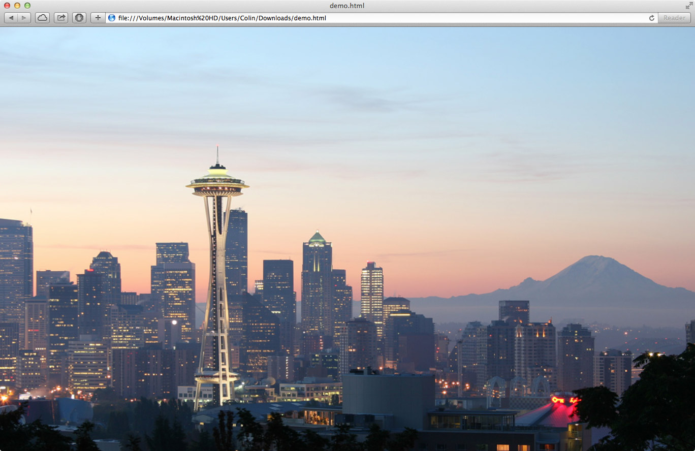

Several of the websites I've created use a background image as part of the design. It turns out that making the image stay centered, maintain the same aspect ratio, scale with the browser, and always fill the entire page is a difficult task. After several infuriating hours of trial and error, I finally figured out how to make all the above occur in a modern browser using only CSS3. [Check out this JSFiddle](http://jsfiddle.net/o286bbpg/) for an example of it in action or read on for an explanation.

The CSS is all applied to the `<body>` tag and uses the `background-size` property to achieve the desired effect. The `cover` value scales the background image such that the background area is completely covered by the background image. Browser specific CSS properties are also defined for cross-browser compatibility (screw IE).


body {
    background:url("bg.jpg") no-repeat center top fixed;
    background-size:cover;
    -webkit-background-size:cover;
    -moz-background-size:cover;
    -o-background-size:cover;
}


When the page is resized, the background image will always maintain its top-centered position and scale to fill the entire page. This will result in cropping of the image on the top/bottom or left/right depending on the window size. The aspect ratio will always be maintained and scrollbars will not show up (unless a minimum dimension is set).


