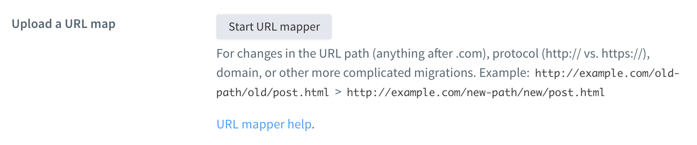
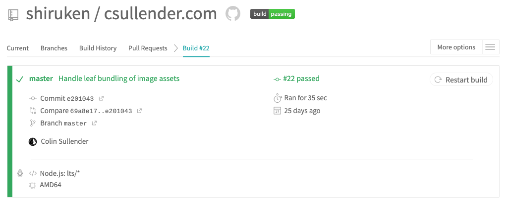

+++ 
draft = false
date = 2020-03-07T12:10:00-06:00
title = "Goodbye WordPress. Hello Hugo."
tags = ['Web', 'Design', 'Software', 'Tips & Tricks']
+++

After eight years of [using WordPress](), I finally decided it's time to rid myself of the [cumbersome, error-prone beast](https://www.quora.com/Why-is-WordPress-so-bad-and-are-there-any-real-alternatives) in favor of a static website. I rarely post blog entries anymore, so the convenience of the WordPress text editor and dynamic content has lost its appeal, especially since this website now primarily serves as a digital portfolio. After far too much research (i.e. perusing Reddit threads), I decided to use a static site generator to create and maintain the new website.

I already have some experience with static site generators, since my [Science GIFs archive](https://sciencegifs.csullender.com/) uses [GitHub Pages](https://pages.github.com/), which is powered by [Jekyll](https://jekyllrb.com/). As I was learning about the transition from WordPress, I ran across another Markdown-based static site generator called [Hugo](https://gohugo.io/) that claimed to be the "world's fastest framework for building websites." Unlike Jekyll, which requires Ruby to operate, Hugo is a compiled [Go](https://golang.org/) program that only requires the download of a single binary for easy setup regardless of operating system. While build times are irrelevant for small websites such as my own, I figured it would be a good experience trying a completely new framework.


# Hugo Setup

Thanks to the magic of the [Homebrew](https://brew.sh/) package manager for macOS, installing Hugo is even easier than downloading the binary from their website:

```
brew install hugo
```

I generally followed the [Quick Start guide](https://gohugo.io/getting-started/quick-start/) to initialize the website and select a theme from the [expansive gallery](https://themes.gohugo.io/). Because I intended to turn my website into more of a digital portfolio and less of a blog, I wanted a theme with a minimalist static frontpage. I eventually settled upon the simple [Hugo Coder](https://github.com/luizdepra/hugo-coder) theme.


# Migrating from WordPress

In order to transition my WordPress content to Hugo, I utilized the [blog2md](https://github.com/palaniraja/blog2md) utility. This [Node.js](https://nodejs.org/) program takes the .xml file exported by WordPress' backup tool and converts each page and post into individual Markdown files, maintaining the formatting, timestamps, and tags reasonably well. Unfortunately I had to go through each entry and manually correct line breaks and update image urls to be compatible with Hugo's [directory structure](https://gohugo.io/getting-started/directory-structure/).

Instead of dumping all of my images into the `/static/image` directory, I opted to create individual subdirectories for each page ([Leaf Bundles](https://gohugo.io/content-management/page-bundles/#leaf-bundles)) to keep related content better organized.

```
content
└── posts
  └── hello-world
    ├── index.md
    ├── image_1.png
    ├── image_2.png
```

While this requires moving the migrated Markdown files from `posts/hello-world.md` to `posts/hello-world/index.md`, it permits easier linking to photos/files since they are now in the same directory. This also avoids an asset management nightmare where all the images would typically be located elsewhere in the `/static/` directory.

```

```

## Image Galleries

Several of my blog entries utilized WordPress' media features to create organized image galleries for displaying content. While Hugo and the Coder theme lack native image grid layouts, there are numerous custom [shortcodes](https://gohugo.io/content-management/shortcodes/) that offer such features. One such implementation is [Hugo Easy Gallery](https://github.com/liwenyip/hugo-easy-gallery), which can easily create responsive, [Photoswipe](https://photoswipe.com/)-powered image galleries with a single shortcode.

In order to recreate the layouts used in my WordPress content, I had to modify the [`gallery.html`](https://github.com/shiruken/csullender.com/blob/master/layouts/shortcodes/gallery.html) shortcode and the [`hugo-easy-gallery.css`](https://github.com/shiruken/csullender.com/blob/master/static/css/hugo-easy-gallery.css) stylesheet to explicitly control the number of images displayed per row in a gallery. Specifically, I wanted to be able to display either two or five images per row with the option to display full-size images without cropping. I also had to [slightly modify](https://github.com/shiruken/csullender.com/commit/e20104375c700534d29516e814e705504e4d6b3b) the handling of image paths to accommodate for leaf bundles.

Here's an example of a gallery with two wide images per row (4:3 aspect ratio):

```

```

 

And a gallery with five square images per row (1:1 aspect ratio):

```

```



You can see examples of galleries in action on the following posts:

* [Facebook Photo Compression]()
* [Top Music of 2013]()


## Transfer Disqus Comments

I was never a fan of WordPress' commenting system, so I've used [Disqus](https://disqus.com/) to host and moderate comments on my website for years now. This made the transition to Hugo even easier since it natively ships with an [internal Disqus template](https://gohugo.io/content-management/comments/#add-disqus) that is configured simply by adding your `disqusShortname` to the configuration file. However, because I decided to change the permalink structure from `/blog/YYYY/MM/DD/title` to `/posts/title`, I had to use the [URL Mapping tool](https://disqus.com/admin/discussions/migrate/) to link existing comments to their respective pages on the new website.



Functionally, this is performed by exporting a CSV file listing each URL that has existing Disqus comments and simply adding the new URL as the second element in each row. Uploading the modified file back to Disqus results in the permanent remapping of the comments to the new URL schema.


# Automating Deployment with Travis CI

Obviously, one of the major advantages of WordPress is that hitting the "publish" button results in your new content automatically appearing without requiring any intermediate steps. Unlike Jekyll, which is [heavily integrated with GitHub Pages](https://jekyllrb.com/docs/github-pages/) for streamlined use, Hugo requires a [little more effort](https://gohugo.io/hosting-and-deployment/) to host and deploy online. By far the easiest option is to [use Netlify](https://gohugo.io/hosting-and-deployment/hosting-on-netlify/) to host your Hugo site with their CDN and continuous deployment through your version control system of choice. However, if you already have a server or need to run other dynamic pages alongside your static Hugo content, then it's not an optimal solution.

After deciding that I wanted something a little more automatic than manual deployment with [an Rsync script](https://gohugo.io/hosting-and-deployment/deployment-with-rsync/), I ran across [this excellent guide](https://blog.martignoni.net/2019/03/deploy-your-hugo-site/) on how to deploy Hugo through SSH with Travis. _(If that sounds like I just made up a bunch of words, that's how I felt the first time learning about it.)_ For the uninitiated, [Travis CI](https://travis-ci.org/) is a "continuous integration service" used for automatically building and testing projects hosted on GitHub. Each time a new commit is made to the repository, Travis will build the Hugo site and deploy the resulting files to my hosting provider using [rsync](https://linux.die.net/man/1/rsync). My latest Travis configuration file can be found here: [`.travis.yml`](https://github.com/shiruken/csullender.com/blob/master/.travis.yml).



The end result is not that dissimilar from the WordPress experience: When I "publish" a change to GitHub, my website is automatically updated without any further input (except for the occasional debugging 😅). With the exception of a few dynamic pages (i.e. PHP), my website is now entirely static and eliminates the headache of dealing with WordPress or backend issues on my cheap hosting service.