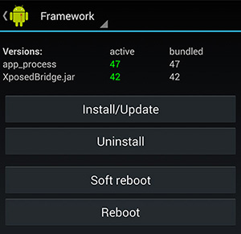
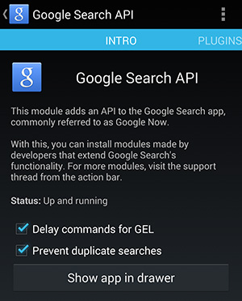

The digital currency [Bitcoin](http://bitcoin.org/) has [grown increasingly popular](https://blockchain.info/charts/market-cap) in [recent months](http://www.google.com/trends/explore#q=bitcoin&date=1%2F2012%2025m&cmpt=q) as [more and more businesses have begun accepting](https://en.bitcoin.it/wiki/Trade) the peer-to-peer cryptocurrency. Keeping up with the highly volatile price of Bitcion (BTC) is a must for traders, who use exchanges such as [Mt.Gox](https://www.mtgox.com/) or [BTC-E](https://btc-e.com/) to turn a profit. Even the casual holder through services such as [Coinbase](https://coinbase.com/) need to see how much their BTC are worth. While there are [many websites](http://bitcoinwisdom.com/) that track the price of BTC across exchanges, there is no official integration into Google's search engine. For Android users, Google Now/Search is at the heart of their device's functionality. [MohammadAG recently released an XPOSED module](http://forum.xda-developers.com/showthread.php?p=48109086#post48109086) that adds an API to the Google Search app. This guide will help you install the necessary applications and modifications to use the "Okay Google" voice command to get the current price of Bitcoin on Mt.Gox from [BitcoinWisdom](http://bitcoinwisdom.com/).



What You'll Need:

1.  Rooted Android Device
2.  [Xposed Framework](http://forum.xda-developers.com/showthread.php?t=1574401)
3.  [Google Search API Xposed Module](http://forum.xda-developers.com/showthread.php?p=48109086#post48109086)
4.  [Tasker](https://play.google.com/store/apps/details?id=net.dinglisch.android.taskerm) (free trial available on [developer website](http://tasker.dinglisch.net/download.html))
5.  [Autovoice Tasker plugin](https://play.google.com/store/apps/details?id=com.joaomgcd.autovoice)

The first step is to install the Xposed Framework, which can be found in the middle of this [XDA forum post](http://forum.xda-developers.com/showthread.php?t=1574401). There's a lot of text preceding the download link, so be sure to take some time to understand what you're doing to your device. Once you've downloaded and installed the APK, launch the Xposed Installer, go to "Framework," and click on "Install/Update." Restart your device.

With the Xposed Framework setup, download and install the [Google Search API module](http://forum.xda-developers.com/showthread.php?p=48109086#post48109086). Open up the Xposed Installer and go to the "Modules" section and activate the Google Search API module. Now open up the Google Search API application and make sure both textboxes are ticked. You can hide the icon from the drawer if you'd like since you can always launch from the Xposed Installer.

Now we transition to the workhorse of Android automation, [Tasker](https://play.google.com/store/apps/details?id=net.dinglisch.android.taskerm). If you don't already own the full version of this app, it's definitely worth the $2.99 price tag. Once you've installed it, you'll need to install the [AutoVoice Tasker plugin](https://play.google.com/store/apps/details?id=com.joaomgcd.autovoice). The free version is severely handicapped by only allowing for commands with 4 characters, so you might consider shelling out $1.57 to get the full version. However, this should work with the limited version, although you'll need to take that into account when creating the voice command. Once AutoVoice is installed, open the app and make sure that the "Google Now Integration" is enabled.

Now it's time to create the Tasker task to create our BTC price lookup. The functionality comes in two parts: 1) A profile consisting of an _AutoVoice Recognized Event Behavior_ and 2) A task that grabs the BitcoinWisdom website and extracts the current price.

*   Open Tasker and navigate to the `Profiles` tab.
*   Push the **+** in the bottom right corner.
*   Select `State > Plugin > AutoVoice Recognized`.
*   On the `Configuration` line, select the pencil to open AutoVoice settings.
*   Select the `Event Behavior` checkbox.
*   Click on `Command Filter` to set the voice command to trigger this task. I used _"What's the current price of Bitcoin"_ but you can use anything you want.
*   Select the `Exact Command` checkbox and set any other settings you want (trigger, regex, etc.).
*   Click the checkmark at the top to return to Tasker.
*   Click on the Tasker logo at the top left to complete the profile.
*   Select the imported task or create and name a new one.

At this point your trigger is established and you need to connect it to a task. I've [included the .xml file for the entire task here](https://drive.google.com/file/d/0Bx3p6yyQUcUIdDNzMm1UdTNabFk/edit?usp=sharing) if you'd like to import it into Tasker rather than following the creation steps below. Simply select the imported task (`Tasks > Home Button > Import`) for the profile you just created. If you'd rather create it yourself, then follow onwards below!

*   Go to the `Task Edit` page for our task.
*   Add `Net > HTTP Get`.
*   Set the _Server:Port_ to http://bitcoinwisdom.com/ and return to the Task Edit page.
*   Add `Variable > Variable Split`.
*   Name the variable `%HTTPD` and set the splitter as ``
*   Return to the Task Edit page and add a `Task > If` statement.
*   Set the condition to `%HTTPD2 Is Set` and return to Task Edit page.
*   Underneath the if statement, create another `Variable > Variable Split`.
*   Name the variable `%HTTPD2` and set the splitter as ``
*   Return to the Task Edit page and add another `Task > If` statement.
*   Set the condition to `%HTTPD21 Is Set` and return to Task Edit page.
*   Add `Misc > Say` and set the text to "_the current price of bit coin is %HTTPD21 dollars_."
*   Return to the Task Edit page and add a `Task > End If` statement.
*   Return to the Task Edit page and add another `Task > End If` statement.
*   Return to the Task Edit page and add `Variable > Variable Clear`.
*   Set the name field to `%HTTPD*` to clear all the variables we set.

If all went well you should now have a fully functional task! What happens is upon the AutoVoice command being recognized, Tasker will load the BitcoinWisdom website. It then splits the HTML based on the delimiters we defined to extract the current price of Bitcoin from MtGox. If it successfully populated the resulting split variables, then it will speak the price using the same voice used for Google Now. Your task should look something like this:

If you want to get the price of different markets, then you'll need to modify the first Variable Split to match the HTML ids on the BitcoinWisdom website. You could also use a completely different website but you'll need to modify more of the variable splits to extract the price. Now when you want to know the current price of Bitcoin, you don't have to rely upon physical interaction with your device. Just say "Okay Google, what's the current price of Bitcoin?" and (hopefully) you'll have it read back to you without delay!