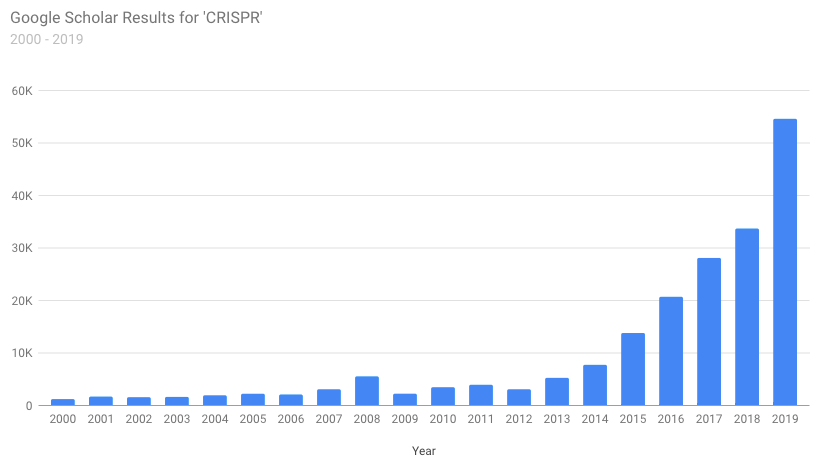

One of the most common images I see during science presentations is the frequency of publications within a particular field over time. It's a great way to show the growth of the field while attempting to validate the worthiness of the research that follows. As far as I can tell, most people manually assemble this data with sequential searches on [Google Scholar](https://scholar.google.com/) or [Web of Science](https://webofknowledge.com/). This seemed like a straightforward opportunity for automation, so ~~I made a little website~~ (_Deprecated July 2022_) that does just that. It takes a Google Scholar search query and a range of years and plots the number of results over time.

Obviously since we're plotting the number of search results this doesn't necessarily match the actual number of relevant publications. It's really just meant to provide a broad overview of the growth (or decline) or a field of study. Once the results are gathered, the range of years graphed can easily be changed using the drop-down menus. The raw data is also available for export into your favorite visualization program.



For those who are interested, the entire page is powered by Javascript and utilizes a JQuery plugin called [Ajax Cross Origin](http://www.ajax-cross-origin.com) to overcome the [Same Origin Policy](http://en.wikipedia.org/wiki/Same-origin_policy). This is definitely a rough solution but until Google releases an API for Scholar there's not much of an alternative (please don't get mad at me). As usual the charts are generated using Google Charts and I opted to try out the [new Material Design versions](https://developers.google.com/chart/interactive/docs/gallery/barchart#Material) currently in testing. Because they're kinda sorta prettier.

~~**Check it out:** **Scholar Plotr**~~ (_Deprecated July 2022_)