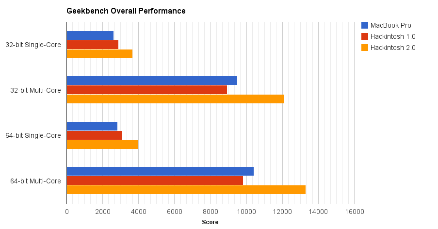
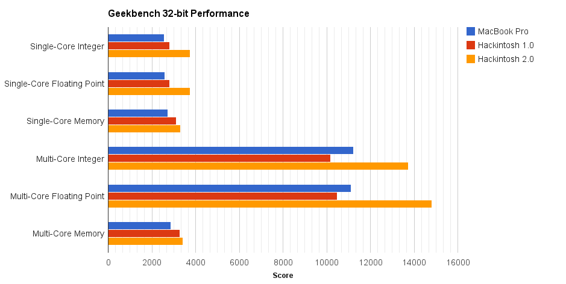
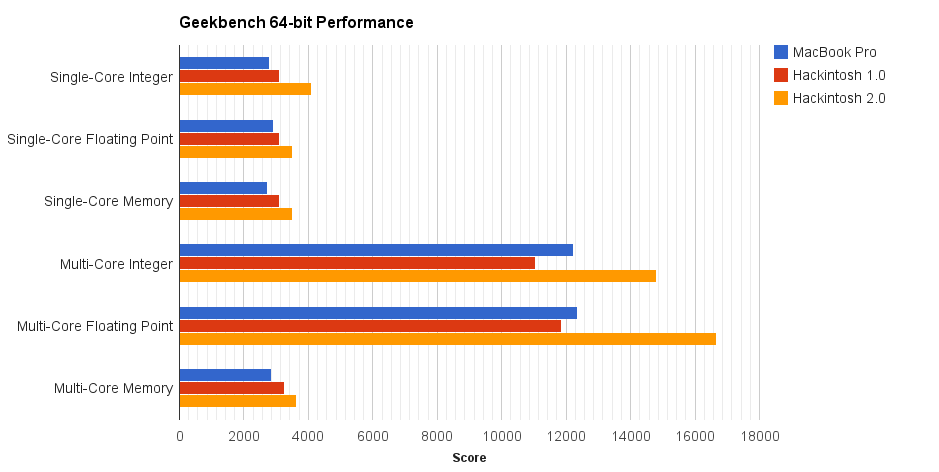
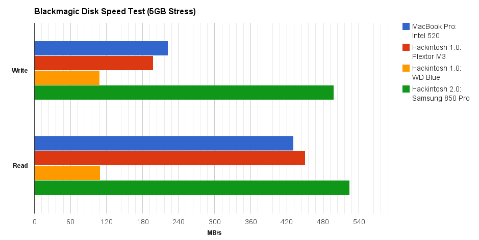
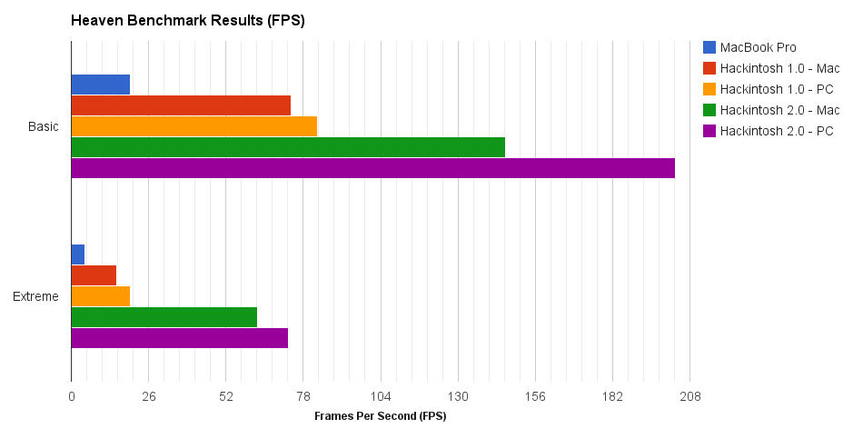

Since I am obsessed with quantifying things, I absolutely had to benchmark my [new Hackintosh rig]( "Hackintosh 2.0") to see what my new purchases had afforded cost me. I ran a handful of different benchmarks under both OS X and Windows boots to see what the [Intel Core i5-4690K](http://www.newegg.com/Product/Product.aspx?Item=N82E16819117372), [EVGA GeForce GTX 970 SC](http://www.newegg.com/Product/Product.aspx?Item=N82E16814487076), and [Samsung 850 Pro](http://www.newegg.com/Product/Product.aspx?Item=N82E16820147360) could do. So without further ado, here are the results of my benchmarks!

# [Geekbench](https://www.geekbench.com/)

Tested processor performance across [Hackintosh v1.0]( "The Hackintosh"), [v2.0]( "Hackintosh 2.0"), and a MacBook Pro (Early 2011, 15-inch). All tests were conducted 5 times and averaged together on OS X 10.10.1 Yosemite with no overclocking. While the i5-2500K (3.3GHz) in my original Hackintosh had similar performance to the i7-2720QM (2.2GHz) in the MacBook Pro, the i5-4690K (3.5GHz) offers all-around better performance. **Based on overall Geekbench scores, the Hackintosh v2.0 system is roughly 33% better than its predecessor.**

# [Blackmagic Disk Speed Test](https://itunes.apple.com/us/app/blackmagic-disk-speed-test/id425264550)

Tested drive speed during 5GB stress test (5x iterations) across four different drives:

*   Intel 520 SSD (240GB) - MacBook Pro (Early 2011, 15-inch)
*   Plextor M3 SSD (128GB) - Hackintosh v1.0 OS X Drive
*   Samsung 850 Pro SSD (256GB) - Hackintosh v2.0 OS X Drive
*   Western Digital Blue HDD (1TB) - Media

At the time of purchase, the Samsung 850 Pro was [considered one of the best SSDs available](http://ssd.userbenchmark.com/Samsung-850-Pro-256GB/Rating/2385) so it's no surprise that it blows the competition out of the water. **Its read speed is 16% faster than its predecessor while its write speed is a whopping 152% faster.** Samsung's V-NAND technology is quite impressive!

# [Xbench](http://www.xbench.com/)

Tested CPU, memory, Quartz graphics, OpenGL graphics, and disk speed with [Hackintosh v1.0]( "The Hackintosh"), [v2.0]( "Hackintosh 2.0"), and a MacBook Pro (Early 2011, 15-inch). Tests were conducted 5 times and averaged together on OS X 10.10.1 with no overclocking. _Note: Xbench is an older benchmarking software and uses an outdated version of OpenGL hence the poor graphics performance._ **The Hackintosh v2.0 system outperformed its predecessor by anywhere from 30-70% across the different tests.**

# [Heaven Benchmark](https://unigine.com/products/heaven/)

Intensive graphics test of [Hackintosh v1.0]( "The Hackintosh") and [v2.0]( "Hackintosh 2.0") with both OS X and Windows boots as well as Macbook Pro (Early 2011, 15-inch). Tests were conducted in triplicate using both the `Basic` and `Extreme` presets. OS X tests used OpenGL 4.0 and Windows tests used Direct X11. **The GeForce GTX 970 massively outperforms the AMD Radeon 6870 HD by 200% on Basic and 400% on Extreme.** Performance on Windows was 10-15% higher than on OS X, which is not surprising since the NVIDIA drivers for 10.10 are still considered in development. Obviously the mobile graphics card (AMD Radeon HD 6750M) can barely handle anything and gets completely destroyed by the desktops.

# [GPUTest](http://www.geeks3d.com/gputest/)

Intensive OpenGL graphics test of [Hackintosh v1.0]( "The Hackintosh") and [v2.0]( "Hackintosh 2.0") with both OS X and Windows boots as well as Macbook Pro (Early 2011, 15-inch). Tests were conducted in triplicate in fullscreen mode at native resolution (1920x1080 for desktop, 1680x1050 for laptop). **Hackintosh v2.0 performance exceeded its predecessor by at least 200% across both OS X and Windows.** The under-development NVIDIA GeForce drivers for Mac clearly underperform (~50%) compared to the better-established Windows drivers. Hopefully they will one day achieve the parity exhibited by my old AMD Radeon 6870 HD.

# Summary

Hackintosh v2.0 offers vastly faster drive speed (150%) and much more powerful graphics (200%) than its predecessor. The CPU upgrade only boosted speeds by ~33% but that is a pretty considerably upgrade after only two years.