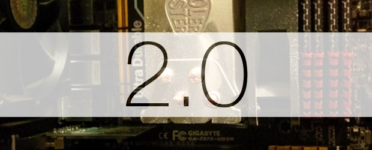
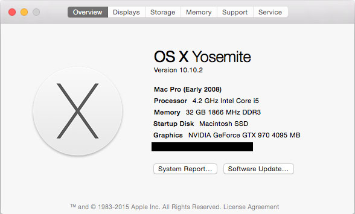

It's been roughly two years since I built my [original Hackintosh]( "The Hackintosh") desktop computer and I decided earlier this year that the time was ripe for an upgrade. After considerable waffling on the exact components to get, I finally settled on an relatively high-end build largely based on the [December CustoMac Buyer's Guide](http://www.tonymacx86.com/building-customac-buyers-guide-december-2014.html) that reused a few components from my original Hackintosh ([case](http://www.newegg.com/Product/Product.aspx?Item=N82E16811139008), [power supply](http://www.newegg.com/Product/Product.aspx?Item=N82E16817371031), and [memory](http://www.newegg.com/Product/Product.aspx?Item=N82E16820231429)).

*   [Gigabyte GA-Z97X-UD5H](http://www.newegg.com/Product/Product.aspx?Item=N82E16813128707) (Motherboard)
*   [Intel Core i5-4690K](http://www.newegg.com/Product/Product.aspx?Item=N82E16819117372) (CPU)
*   [EVGA GeForce GTX 970 Superclocked](http://www.newegg.com/Product/Product.aspx?Item=N82E16814487076) (GPU)
*   [Samsung 850 Pro SSD 256GB](http://www.newegg.com/Product/Product.aspx?Item=N82E16820147360) (SSD)
*   [TP-Link PCI Express Wifi Adapter](http://www.newegg.com/Product/Product.aspx?Item=9SIA1CZ1H27204) (WiFi)

The most difficult decision by far concerned the graphics card since the current generation [Mac Pro](https://www.apple.com/mac-pro/specs/) uses a custom AMD GPU whereas most Hackintosh guides recommend NVIDIA cards. Since there are currently no Macs with any of these NVIDIA cards, there is no native support for them in OS X. This obviously makes using them a little more difficult compared to my first build which basically worked out-of-box. After [extensive research](http://www.tonymacx86.com/graphics/143435-nvidia-releases-alternate-graphics-drivers-10-10-0-343-01-01-maxwell-geforce-gtx-970-980-support.html), I decided on the [GeForce GTX 970](http://www.newegg.com/Product/Product.aspx?Item=N82E16814487076) since recently released [alternate drivers from NVIDIA](http://www.tonymacx86.com/graphics/155506-nvidia-releases-alternate-graphics-drivers-10-10-2-343-02-02-a.html) made the card viable on OS X 10.10 Yosemite without too much trouble.

Once I had all the parts, I had to empty and clean my case in preparation for the new build. This turned out to be an absolute nightmare since it had become quite the dust farm over the past two years. In retrospect, I should have probably done a better job cleaning it more regularly. Fortunately this was easily resolved with several cans of compressed air and left me a clean case ready for new components.

The installation followed [Tonymacx86's UniBeast guide](http://www.tonymacx86.com/yosemite-desktop-guides/143976-unibeast-install-os-x-yosemite-any-supported-intel-based-pc.html) and was straightforward until attempting to get the graphics card to work properly. The majority of guides recommended 1) installing OS X Yosemite using onboard graphics, 2) running Multibeast from the UniBeast drive, 3) plugging in the graphics card, and then 4) installing alternate NVIDIA graphics drivers. Of course, this resulted in immediate kernel panic when trying to boot without the UniBeast drive or safe mode. Despite several reinstallations, I could never get the graphics card to work properly. The only brightside of this ordeal was how quick the installation process was on the Samsung 850 Pro SSD (so fast).

I eventually gave up on the previously described installation process and started trying one I had encountered in part on Reddit. It relied upon a variety of boot flags and NVIDIA CUDA drivers to install the GPU drivers without the card being recognized by the system. The entire process was completed with my monitor plugged into the GPU (not the motherboard). I've summarized the procedure below (likely for my own future reference):

1. Boot from [Unibeast](http://www.unibeast.com/) USB using following Chimera flags: `nv_disable=1, maxmem=4096, GraphicsEnabler=Yes`

2. Install Yosemite to target internal drive

3. Reboot using Unibeast USB and select new OS X installation in Chimera with same flags: `nv_disable=1, maxmem=4096, GraphicsEnabler=Yes`

4. Complete OS X account setup and run [Multibeast](http://www.multibeast.com/) ([My Settings](https://drive.google.com/file/d/0Bx3p6yyQUcUIS21sdGFXVmZlU2c/view?usp=sharing) - Mac Pro 3,1 System Definition)

5. Add following key to /Extra/org.chameleon.Boot.plist: `<key>Kernel Flags</key> <string>nvda_drv=1</string>`

6. Go to System Preferences > Security and allow installation from "Anywhere"

7. Download and install [NVIDIA CUDA Driver](http://www.nvidia.com/object/mac-driver-archive.html)

8. Download and install [NVIDIA GeForce Driver](http://www.nvidia.com/download/driverResults.aspx/79077/en-us) (check version)

9. Reboot using OS X drive and proceed through Chimera without flags (fingers crossed)

This process worked flawlessly and I was up and running OS X Yosemite on my new Hackintosh in a matter of minutes. It bypasses the hassle of removing RAM sticks and allows you to work with the graphics card installed but not loading (`nv_disable=1`). More importantly it drastically streamlines the setup process to only require a single reboot after OS X installation. The only noticeable effects of installing with the driverless GPU occur during the Multibeast + NVIDIA setup where the interface is glitchy and sluggish. This problem is resolved upon driver installation, so it's almost not worth mentioning.

Unfortunately, NVIDIA does not have a webpage listing all of the iterations of the Mac GeForce drivers like it does [for CUDA](http://www.nvidia.com/object/mac-driver-archive.html). I've linked to v343.01.01 above, which is only suitable for Mac OS X 10.10 Yosemite. These drivers are extremely strict about deactivating on unsupported OS versions, so if you apply an OS update don't be surprised if your graphics card stops working. Your best bet is to go to the [tonymacx86 graphics support forums](http://www.tonymacx86.com/graphics/) and looking for a thread linking to the latest release of the NVIDIA drivers. I'd recommend against using the built-in automatic update in the System Preferences pane since it seems to always fail. _Be careful about security updates too because the 2015-002 Security Update actually updated the OS to 10.10.2 without warning and broke NVIDIA functionality._ When this happens, the system interface becomes glitchy/sluggish (like during installation) but still functional enough for you to go to NVIDIA website and find newer drivers. Just download, install, and reboot and you should be back to normal. Just remember that in order to install the driver, you'll need to have your system defined as a Mac Pro (set with Multibeast).

[**Check out the benchmarks for this system!**]( "Hackintosh 2.0 Benchmark")
