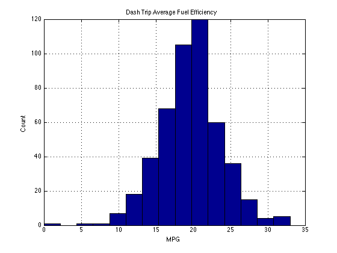

I've been using [Dash](https://dash.by/) in my car for almost six months now to track my driving habits and monitor my car's status. The app interfaces over Bluetooth with an OBD device to read engine codes and access metrics such as speed, fuel efficiency, and engine status. The app tracks every trip and assigns a "Driving Score" based on driving behavior to encourage "better" driving habits. Currently the only way to access the data is [via an IFTTT channel](https://ifttt.com/dash) that logs each trip to a line of a Google Spreadsheet. The developer is working on an [API (aptly named Chassis)](https://dash.by/developers) that will hopefully make access to the data even easier in the coming future. In the meantime, I just used the IFTTT spreadsheet output to assemble some stats and charts.

Since export via IFTTT was added in early June, I've tracked 480 trips covering 1943 miles. That works out to roughly 11.3 miles per day with an average trip distance of 4.08 miles (+/- 4.48 miles). This was not unexpected since that's roughly the distance I drive to and from work everyday. The histogram below shows the distribution of trip distances (excluding a few outliers that significantly distort the graph). It clearly depicts two clusters of distances, which I interpret as representing my home-to-work commute (~4 miles) and my home-to-grocery-store trip (~1 mile).

Next up is the average speed over the course of a trip, with an overall average of 20 MPH (+/- 8 MPH). Clearly the majority of my driving is done within the city limits with limited full-speed interstate driving. While it would take some effort to process the data appropriately, it should be possible to compare average speeds for the exact same trip over time. I suspect that my experience on I-35 is heavily dependent upon time of day (yay rush hour traffic).

Finally, the average reported fuel efficiency for each trip was 19.7 MPG (+/- 4.2 MPG) although I'm somewhat hesitant to believe this value. My car does not actively report this metric so Dash is basing it upon the EPA-testing values, which are notoriously overestimated. Based on my own estimates from fuel-ups, the real fuel efficiency is closer to 18MPG. Nevertheless, it's nice seeing a good ol' Gaussian distribution.

Some other random metrics include average amount of fuel consumed per trip: 0.19 gallons (+/- 0.16 gallons) and average cost per trip: $0.62 (+/- $0.48). Going forward I'm excited to see further development of the Chassis API and hopefully some browser-accessible visualizations of trip data. In the meantime, I'll just keep on logging trips.