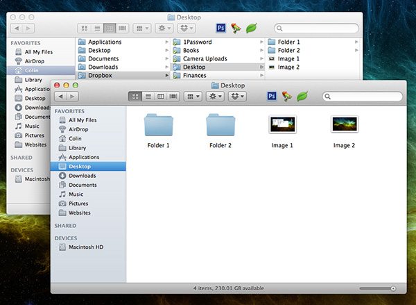

Ever since I got my desktop and relegated my laptop to predominately being my work office computer, I have become heavily reliant upon the incredible [Dropbox](http://db.tt/1M1kZsG) for keeping my files synchronized across the two computers. I had already been keeping my documents backed up to the cloud for several years and amassed about 22GB of free storage space thanks to the invite bonus and a variety of extra space opportunities. I now use the service for keeping my passwords ([1Password](https://agilebits.com/onepassword)), my research library ([Papers](http://www.mekentosj.com/papers/)), and even the desktops on both my computers up-to-date.

Keeping one's desktop folder in sync requires the use of a "symbolic link" to allow Dropbox to track the Desktop folder even though it is not contained within the Dropbox folder itself. A symbolic link (or symlink) is a special file that contains a reference to another file/directory in the form of a relative or absolute path. This effectively means it links directly to the specified file/directory as if it were actually there. This means that Dropbox thinks the file/directory is in your Dropbox folder when it actually is located externally and allows you to sync its content.

It is relatively straightforward to achieve the Desktop sync on your Mac computers and only requires a single Terminal command on each computer you wish to keep synchronized. All you need is Dropbox (duh) and access to the command line app Terminal (should be in the /Applications/Utilities folder). Open Terminal and type in the following simple command:

```
ln -s PATH_TO_DESKTOP_FOLDER PATH_TO_DROPBOX_FOLDER/Desktop
```

**`ln -s`** is the command for creating a symbolic link on an UNIX-like operating system.

**`PATH_TO_DESKTOP_FOLDER`** should be the path to your _Desktop_ folder. For most users, it should simply be `~/Desktop` 

**`PATH_TO_DROPBOX_FOLDER`** should be the path to your _Dropbox_ folder. Unless you specified otherwise when you installed Dropbox, it should probably be **`~/Dropbox/Desktop`**. The addition of **`/Desktop`** specifies that your Desktop should be linked to a symbolic link called **`Desktop`** within your Dropbox folder.

Based on the above, the command should look something like this:


```
ln -s ~/Desktop ~/Dropbox/Desktop
```

Rather than manually typing everything in, you can also type the beginning `ln -s` and drag-and-drop the desired file locations into the Terminal window to have the path automatically inserted. Be sure to add the `/Desktop` to the end of the second path or your Desktop will be synced to the whole Dropbox folder (bad idea). Once you've gotten your first computer setup, go to each of the other computers you'd like to keep in sync and run the same command on them. This will link the Desktop of each computer to the synchronized folder in your Dropbox. This means that whenever you put a file onto the desktop, it will be synchronized to all of your connected computers via Dropbox. This is incredibly useful when you need to transfer files back and forth or are working on a project from your Desktop directory rather than an already synced folder. You can see this at work in the image below where the Desktop folder is kept in sync with the Dropbox folder and propagated between my computers.



The symbolic link can also be used to keep **any** file or directory located externally from your Dropbox folder in sync. Simply change the source file/directory and the target file in the Dropbox folder. Just be careful about referencing removal volumes (e.g. external drives) as this can cause problems if the drive is disconnected when Dropbox is still running.