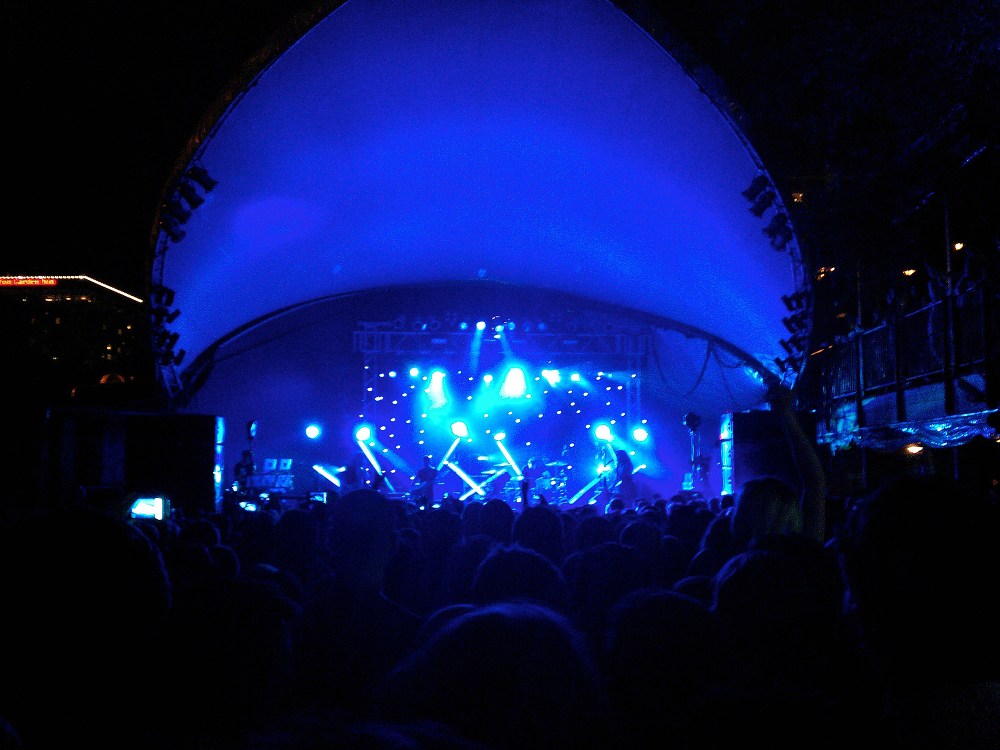
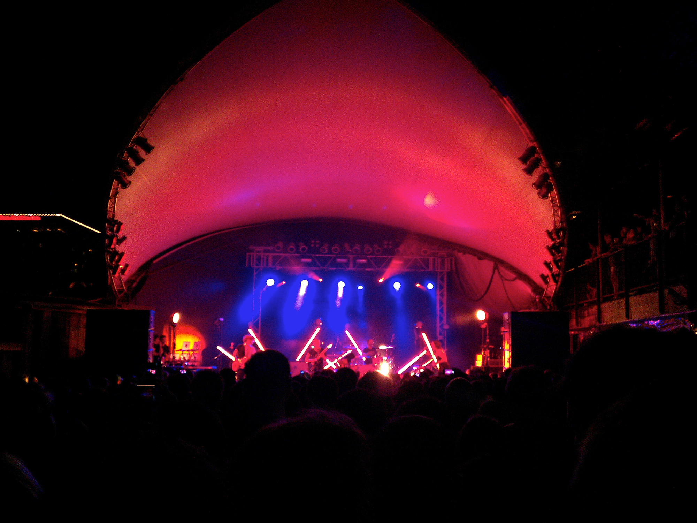

[M83](http://ilovem83.com/) is absolutely one of my favorite bands to see live. While many people find Anthony Gonzalez's heavily shoegaze-influenced music somewhat boring (excluding that one track that everyone knows from _Hurry Up, We're Dreaming_), their live performances are anything but that. From the perfectly implemented light show to the random electronic dance jam sessions in the middle of their more upbeat songs, M83 is a blast to see in concert. Even though there were people at the concert who only wanted to hear "[Midnight City](http://www.youtube.com/watch?v=9aZFcosBTaQ)," there is no denying that the rest of the show was just as energetic. Their extended versions of "[Fall](http://www.youtube.com/watch?v=BFD-dR8ToPM)" from the _TRON: Legacy_ soundtrack and "[Couleurs](http://www.youtube.com/watch?v=wrv0F-WTio4)" from _Saturdays = Youth_ were awesome. Even if you're one of the "only likes Midnight City" crowd, their live performances make that song look boring in comparison. You should seriously see them.

