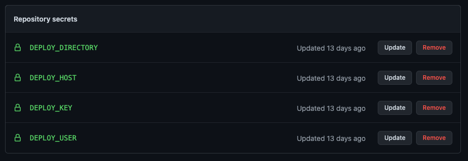
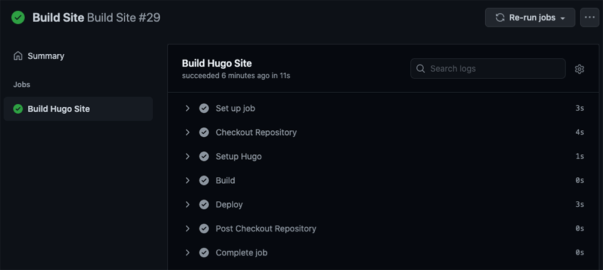

+++
draft = false
date = 2021-02-22T14:12:14-05:00
title = "Migrating Hugo deployment to GitHub Actions from TravisCI"
tags = ['Web', 'Software', 'Tips & Tricks']
+++

With the [recent shutdown of travis-ci.org](https://mailchi.mp/3d439eeb1098/travis-ciorg-is-moving-to-travis-cicom) and the [announcement of a new pricing model](https://blog.travis-ci.com/2020-11-02-travis-ci-new-billing) for TravisCI with limited free usage, I made the decision to migrate the CI/CD for this website to [GitHub Actions](https://github.com/features/actions). As I mentioned [when I first transitioned to using Hugo](), I'm still hosting this website on a paid server to retain a few dynamic pages that would not work properly on a [Netlify deployment](https://gohugo.io/hosting-and-deployment/hosting-on-netlify/). The following are the steps that I took to migrate between services.

# Remove TravisCI from your project and GitHub

Delete the `.travis.yml` configuration file and any other TravisCI-related files in your repository (e.g. encrypted credentials). If you included a build status badge in the README, be sure to remove that as well.

Since this was my only project using TravisCI, I also revoked the [application's permissions on GitHub](https://github.com/settings/applications).

# Add a GitHub Action workflow to your project

The next step is to create a new GitHub Action workflow that will build your Hugo site and deploy it to the server of your choice using [rsync](https://linux.die.net/man/1/rsync). Navigate to the Actions tab in your GitHub repository and select the "Skip this and set up a workflow yourself" option to directly access the workflow editor. Workflows [use YAML syntax](https://docs.github.com/en/actions/reference/workflow-syntax-for-github-actions) and are saved within the `.github/workflows/` directory in your repository.

**The current workflow for building and deploying this website can be seen [**here**](https://github.com/shiruken/csullender.com/blob/master/.github/workflows/build.yml) if you want to skip the explanation below.**

The first section of the file defines the name and the GitHub events that trigger the workflow. We want the workflow to be triggered when code is pushed to any branch in the repository (`push`) or manually triggered by the owner (`workflow_dispatch`).


name: Build Site
on:
  push: 
  workflow_dispatch: 


The next section defines the [job(s)](https://docs.github.com/en/actions/reference/workflow-syntax-for-github-actions#jobs) that constitute the workflow. In this case, there is only a single job called `build` that runs on the latest version of Ubuntu. Jobs are composed of individual [steps](https://docs.github.com/en/actions/reference/workflow-syntax-for-github-actions#jobsjob_idsteps) that are executed sequentially. These steps are frequently predefined GitHub Actions available via the [Marketplace](https://github.com/marketplace?type=actions). 


jobs:
  build:
    name: Build Hugo Site
    runs-on: ubuntu-latest
    steps: 


The first step uses the [`checkout`](https://github.com/marketplace/actions/checkout) action to check-out the current repository into our workspace. Since our Hugo theme ([hugo-coder](https://github.com/luizdepra/hugo-coder)) is included in the project as a submodule, we need to include the `submodules: true` input parameter to properly check it out.


- name: Checkout Repository
  uses: actions/checkout@v2
  with:
    submodules: true


The next step uses the [`actions-hugo`](https://github.com/marketplace/actions/hugo-setup) action to install Hugo to our workspace. The input parameters control the specific version of Hugo to install. The [hugo-coder theme](https://github.com/luizdepra/hugo-coder) requires the extended version of Hugo.


- name: Setup Hugo
  uses: peaceiris/actions-hugo@v2
  with:
    hugo-version: 'latest'
    extended: true


With Hugo installed, we can now build our site using the [`run` command](https://docs.github.com/en/actions/reference/workflow-syntax-for-github-actions#jobsjob_idstepsrun) to call the `hugo` program via the command line. This will output the compiled static site into the `public/` directory.


- name: Build
  run: hugo


We're now ready to deploy our freshly built site to the remote server. However, we only want to deploy if we're on the primary branch, so the final step checks for this condition before proceeding. If we're on a non-primary branch, then the workflow will end here.


- name: Deploy
  if: github.ref == 'refs/heads/master'


In order to deploy to the remote server using rsync, we need to take advantage of encrypted [Repository Secrets](https://docs.github.com/en/actions/reference/encrypted-secrets) to safely store our credentials. You can define these secrets under the settings for your GitHub repository. I opted to use an [SSH key pair](https://docs.github.com/en/github/authenticating-to-github/generating-a-new-ssh-key-and-adding-it-to-the-ssh-agent#generating-a-new-ssh-key) to authenticate with the remote server (storing the private key under `DEPLOY_KEY` and adding the public key to `.ssh/authorized_keys` on the remote) but a password could also be stored this way. I also defined several other additional secrets to mask the username, hostname, and destination on the remote host. Secrets can be accessed in the workflow file using the `{{secrets.SECRETNAME}}` syntax. _Note: GitHub automatically obfuscates any secrets that are accidentally exposed in the logs via command line outputs._

We again use the `run` command to dump the private key to a file in the workspace, adjust the permissions on the key file, and then use `rsync` to sync the contents of `public/` to the remote destination. If all goes well, then your updated site should now be live on your server.


env:
  DEPLOY_KEY: ${{secrets.DEPLOY_KEY}}
  DEST: ${{secrets.DEPLOY_USER}}@${{secrets.DEPLOY_HOST}}:${{secrets.DEPLOY_DIRECTORY}}
run: |
  echo "$DEPLOY_KEY" > deploy_key
  chmod 600 ./deploy_key
  rsync -e 'ssh -i ./deploy_key -o StrictHostKeyChecking=no -o LogLevel=ERROR' -r --quiet --delete-after public/* $DEST


# Test your new GitHub Action workflow

Since we enabled manual triggering of the workflow, we can now easily test it. Navigate to the Actions tab in your repository and select the workflow from the list on the left. Click the "Run workflow" dropdown, select a branch, and then click the green "Run workflow" button. Your workflow should now be manually executing.

If you click through, you can see additional details about the run including the outputs from each stage of the workflow. If you ran the workflow on any branch but the primary one, then the "Deploy" step should have been skipped.

You should now have a fully functional CI/CD setup using GitHub Actions to replace the shuttered Open Source TravisCI service! Hopefully GitHub (more likely Microsoft) doesn't start changing the free offerings on their platform anytime soon. Don't forget to re-add the status badge back to your README file!

