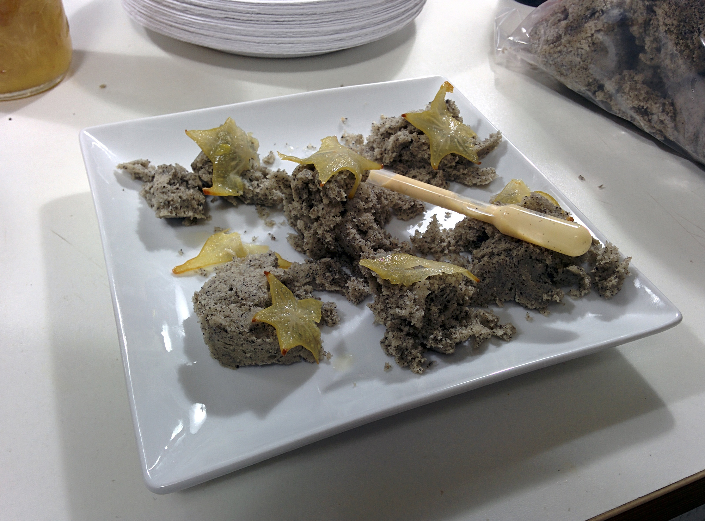

For the past six years, my friend Peter Voyvodic has hosted an annual Oscar party where he serves up food inspired by each of the Academy Award for Best Picture Nominees. I've had the opportunity to attend the past two years (since I've been in Austin) and it has always been a blast. Last year I had a ton of fun assisting with the Sunday food preparation so I was anxious to help again this year.

In an effort to step-up this year's party from previous years, we decided to create video montages to help explain the food rather than relying upon a speech prior to introducing each dish. In order to achieve this, I leveraged the power of the [Google Chromecast](http://www.google.com/intl/en-US/chrome/devices/chromecast/) and the [AllCast app](https://play.google.com/store/apps/details?id=com.koushikdutta.cast) for Android. Using the latter, it was incredibly simple to push a video file from my smartphone to the TV and then take a picture of the dish to later cast onto the screen. This really helped ground the inspiration for each dish for all of the 30+ diners, many of whom had seen few or none of the movies.

Planning the menu started several weeks beforehand and was finalized about a week prior to the party. Cooking for 30-40 people is difficult in a studio apartment kitchen but somehow it happened successfully. The [Sansaire](http://sansaire.com/) immersion circulation, which Peter backed on [Kickstarter](https://www.kickstarter.com/projects/seattlefoodgeek/sansaire-sous-vide-circulator-for-199), made sous vide cooking incredibly easy and really saved a ton of effort. Many of the recipes were from the [Modernist Cuisine at Home](http://modernistcuisine.com/books/modernist-cuisine-at-home/) book and we even got some Twitter love from them for the menu:





The nine dishes served are pictured below. [More pictures of the preparation and the actual event can be found in this Flickr set](http://www.flickr.com/photos/shiruken/sets/72157641837002243/). All photos were taken using a Google Nexus 5 smartphone and I am blown away by how much better they are compared to my old Nexus 4 I had last year.

# The Wolf of Wall Street
_'Cocaine' bacon fat powder, oyster shot, and smoked-ice whiskey_

# Nebraska
_Corn soup, roast beef, and Coors sauce_

# American Hustle
_Chicken piccata and 'science oven' eggplant parmesan_

# Philomena
_Salad with fruitcake croutons, Earl Grey tea gel, walnuts, feta, and Guinness vinaigrette_

# Captain Phillips
_Somali-spiced fish stock, baby octopus, and kombu butter crostini with pickled veggies_

# Dallas Buyers Club
_Skirt steak and navy bean 'pills'_

# Gravity
_Microwaved sesame spongecake, pickled starfruit, and pipette of Tang crème anglaise_

# 12 Years a Slave
_Blackberry icecream and sweet Johnnycakes_

# Her
_Lemongrass cupcakes with gin and lime filling topped with vanilla frosting and fondant notebook_

