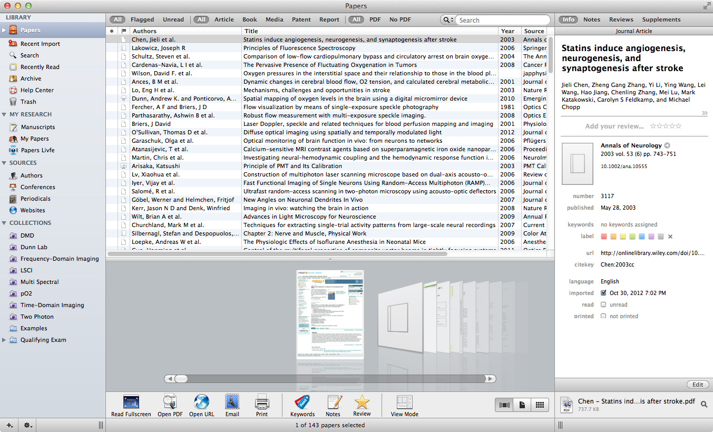

As a graduate student, one of the most important tools I use practically every single day is a citation and bibliography reference manager. I've gone through several ([Endnote](http://endnote.com/), [Mendeley](http://www.mendeley.com/), [Zotero](http://www.zotero.org/), etc.) over the years before finding one I truly liked: [Papers](http://www.mekentosj.com/papers/ "Visit the Papers Website"). Initially a Mac-only client, Papers seemed like a native extension of the OS X environment, akin to that of iTunes or iPhoto. With the ability to search online databases, import articles into a "library" for organization, and cite papers and assemble bibliographies, Papers does everything I needed and wanted from a reference management program. Over the course of its development, numerous features have been added including an iOS app and Windows counterpart.



One of the problems with using multiple computers is keeping your files synced across them. Cloud services like [Dropbox](http://db.tt/1M1kZsG) have been a phenomenal way for syncing folders and files with relative ease and can even be used for [syncing your Desktop](http://www.csullender.com/blog/2012/05/14/keeping-your-desktop-in-sync-with-dropbox/ "Keeping Your Desktops in Sync with Dropbox"). In order to keep your Papers library update to date between your computers, we're once again going to be taking advantage of Dropbox and symbolic links.

**In order to ensure that you do not mess up your library, you should never run Papers on more than one computer at a time when the Dropbox sync is enabled.** Doing so could result in the database becoming corrupt and require you to restore via Time Machine or the Dropbox website interface.

The first thing you need to do is close or disable Dropbox on all the computers you want to sync. Make sure that the Papers application is also closed. You will also need to decide which computer you're using as the initial source for the sync. Open the _Terminal_ app (Applications/Utilities) and enter the following command, replacing `PATH_TO_DROPBOX` with the path to your Dropbox folder:

```
ln -s ~/Library/Application\ Support/Papers2 ~/PATH_TO_DROPBOX/Papers2
```

This will create a symbolic link between the Papers2 database in your user library and a folder named _Papers2_ in your Dropbox folder. Any changes in the Papers2 library on this computer will be tracked by Dropbox (and vice versa). We're done with this computer for now, so re-enable Dropbox and allow it to completely upload the new files (make sure that the Papers app is still closed).

Open up the _Terminal_ app on a computer you want to sync. Before we set up the Dropbox sync, we need to make sure that there isn't already a Papers library present on your computer. If there is, then it could prevent the symbolic link from forming or possibly mess up your library. Copy and paste the following command and press enter:

```
rmdir ~/Library/Application\ Support/Papers2/
```

If there was an existing Papers database, then it will be removed. If there was not, then the response should be something along the lines of "Directory does not exist." With this computer cleared of any existing Papers library, we're ready to set up the Dropbox sync. Since we closed the Dropbox application previously, we need to re-open it (or re-enable syncing) and allow the program to completely sync the folder we added on the other computer. Once Dropbox indicates that all files are up to date, switch back to the Terminal app. Enter the following command, again replacing `PATH_TO_DROPBOX` with the actual location of your Dropbox folder:

```
ln -s ~/PATH_TO_DROPBOX/Papers2 ~/Library/Application\ Support/Papers2
```

This essentially does the opposite of what we did previously: It creates a symbolic link between the Papers2 folder in your Dropbox folder with the correct Papers database location in your user library folder. If all goes well, then it should keep the two in sync. To test if it worked, open up the Papers app and see if your library is 1) functioning and 2) complete. Once again, be careful about having Papers open on multiple computers or you might risk corrupting your database. If you have more than two computers you want to keep in sync, repeat the last section (starting with removing an existing library) for each computer. Hopefully everything works out and this helps you use [Papers](http://www.mekentosj.com/papers/) across your Macs!

**Update:**
This manual syncing of the Papers library has become obsolete in the latest v3 release of Papers. The program itself is capable of managing Dropbox syncing by placing the library folder into Dropbox and making sure that simultaneous edits on different computers are not conflicting. [Read more about it on the Papers website.](http://www.papersapp.com/mac/)