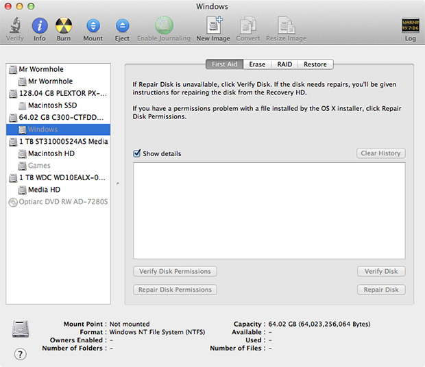
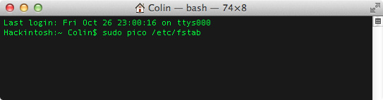

If you're on a Mac with Windows installed via Bootcamp then you've no doubt noticed that the Bootcamp partition mounts as another drive when using OSX. I rarely needed access to the contents of my Bootcamp installation so I thought it'd be nice to prevent the partition from mounting at all on the Mac side of things. There's a relatively easy way to achieve this using just a little bit of command line fiddling. The only thing you need is administrative rights on the computer. The first thing we need to know is the Universal Unique Identifier (UUID) of the Bootcamp partition that you want to prevent from automatically mounting. Open up the **Disk Utility** application located in the Utilities folder of your Application folder. Locate the desired partition in the list on the left as shown below. In my case, the partition is called "Windows"

**Note: A single drive may have multiple partitions, so select the correct one.**



Click on the "Info" button in the toolbar to pull up an info window about that particular partition. What we're looking for is the Universal Unique Identifier parameter (highlighted) that identifies this partition for the operating system. Write it down or copy it to your clipboard.


Armed with the UUID of your partition, open up the Terminal application (also located in the Utilities folder) and type in the following command

```
sudo pico /etc/fstab
```



You will be prompted to enter an administrator password (more than likely just your account password) to continue. This will create and open a file on the command line where you will then enter the following text, replacing the string of F's with the UUID of your partition.

```
UUID=FFFFFFFF-FFFF-FFFF-FFFF-FFFFFFFFFFFF none ntfs rw,noauto
```


Press the keys **Control + o** and then **Enter** to save the modifications to the file. Press the keys **Control + x** to exit the file editing interface. At this point you're done and you can close the Terminal app. If you've done it correctly, the next time you restart your computer the Bootcamp partition shouldn't be mounted. You can always mount it manually with the Disk Utility application should the need arise.

**Note: This isn't limited to just the Bootcamp drive, you can do it with any partition on your computer's internal or external drives.**