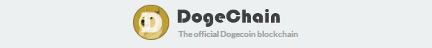
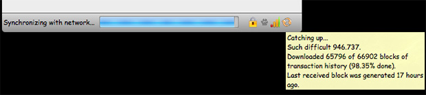

While [Bitcoin](http://bitcoin.org/) is the undisputed leader of the cryptocurrency world, a meme-based alternative called [Dogecoin](http://dogecoin.com/) has gained steam over the past month. Sporting the comical Shiba Inu dog character from the "doge" meme, this altcoin gained significant media coverage recently after [helping raise $30,000 for the Jamaican bobsled team](http://www.theguardian.com/technology/2014/jan/20/jamaican-bobsled-team-raises-dogecoin-winter-olympics) for the 2014 Sochi Winter Olympics. Promoters of this cryptocurrency have been extremely vocal about the carefree attitude surrounding Dogecoin and actively encourage giving freely to others (tipping) in order to raise awareness. The userbase has exploded since its December 6, 2013, introduction with over 33 billion Dogecoin mined to date. The growing online presence and transaction volume have caused the Dogecoin [blockchain](https://en.bitcoin.it/wiki/Block_chain) to swell to over 2GB in size. The [lack of a thin client](http://www.reddit.com/r/dogecoin/comments/1upa5y/bounty_15_million_doge_for_the_first_person_to/) means that new users must download and verify the entire blockchain before they can participate. While online wallets do exist, many users are wary following a [Christmas Day hack](http://www.theverge.com/2013/12/26/5244604/millions-of-dogecoin-stolen-in-christmas-hack) that resulted in the loss of millions of Dogecoin. The desktop wallet software offers client-side encryption and eliminates the need to trust a third party to secure your assets. The downsides of the desktop client are the extremely slow initial sync and need to constantly resync with the blockchain network. Fortunately there's a trick that can help speed up the initial blockchain download by loading the blockchain from a local file rather than the network.

The official Dogecoin blockchain, [Dogechain](http://dogechain.info/chain/Dogecoin), allows users to download a file called `bootstrap.dat` for exactly this purpose. This file contains the entire blockchain up to a certain point in time, which allows for rapid local importing of blocks into the desktop client database. In order to use this trick, you will need to start with a fresh dogecoin-qt instance. This means you will need to delete any existing database files in your Dogecoin directory. The Dogecoin directory is located at the following paths:

* Windows: `C:\Users\YOUR_ACCOUNT\AppData\Roaming\Dogecoin`
* Mac: `~/Libarary/Application Support/Dogecoin`

Once you've navigated to the directory, delete all files EXCEPT for `wallet.dat` and `dogecoin.conf` (if they exist). If you are loading an existing wallet, then copy your `wallet.dat` file into the directory now. Be sure to always keep a backup of your wallet file in case of hard drive failure or data corruption. If you are running the wallet for the first time, you'll need to create the directory, which obviously will be empty.

~~Go to the [Dogechain download page](http://dogechain.info/bootstrap.dat) and download the `bootstrap.dat` file from one of the mirrors. The file is over 900MB, so be prepared to wait a little while. _Note: The current file is a little old but will help accelerate the blockchain syncing process nonetheless. The Dogechain website is working on a better distribution system for automatically updated bootstrap files._~~

~~**Update:** Someone has compiled a more up-to-date version of the bootstrap file and [made it available for download via Mediafire.](http://www.mediafire.com/download/oxs9gd10bcnkmwp/bootstrap.zip) I have not verified the integrity of the file, so be careful using it.~~ 

~~**Update:** [A nightly bootstrap file is now being automatically generated on this website](https://bootstrap.chain.so/). Check it out to get the most up-to-date version.~~

**Update (2021-02-09):** The above sources are all either now unavailable or years out-of-date. Currently the best option to is to download the uncompressed blockchain via [this torrent](https://dogecoin.gg/dogecoin-bootstrap-2021-01-29.torrent) that was generated on 2021-01-29 (Warning: It's 45 GB). Instead of a single `bootstrap.dat` file, you'll find two folders containing the entire blockchain (`blocks/`) and its most recent state (`chainstate/`) at the time of torrent creation.

Once you have all the files downloaded, move both folders into your Dogecoin data directory (see above) and start the desktop client. The wallet should automatically recognize the downloaded blocks and connect to the network to download the remaining ones. This could still take a significant amount of time, so it's probably best to let it run overnight.

Once the desktop wallet is synchronized with the blockchain, you can remove the `bootstrap.dat.old` file (if one exists) to recover drive space. If all goes well, then this should significantly speed up the initialization of your Dogecoin wallet and set you well on your way to the moon!

Tips: [DMJD5xUxr3Vyft3s6JhhrPNrd15mrhMuLA](dogecoin:DMJD5xUxr3Vyft3s6JhhrPNrd15mrhMuLA)