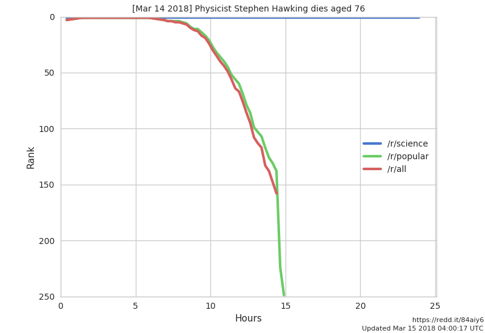

As the news of [Stephen Hawking's death](http://www.bbc.com/news/uk-43396008) reverberated across the internet, the [r/science community](https://www.reddit.com/r/science/) on Reddit made an unusual post: [An opportunity to discuss the life of one of humanity's greatest minds](https://www.reddit.com/r/science/comments/84aiy6/physicist_stephen_hawking_dies_aged_76/). It was the first post of its kind in a subreddit normally dedicated to talking about science papers. However, the moderator team decided his passing warranted acknowledgement given his contributions to physics and his role as the most widely recognized science communicator on the planet. He had also previously participated in [an Ask Me Anything](https://www.reddit.com/r/science/comments/3nyn5i/science_ama_series_stephen_hawking_ama_answers/) in our subreddit.

The post rocketed onto the frontpage of Reddit within 20 minutes. It claimed the #1 spot on r/all within an hour and remained there for over 5 hours. **By time it fell out of the top 25, it had been on the frontpage for 9 hours and 40 minutes**.

The post garnered over **195,000 karma**, making it the [**highest-scoring submission of all time on r/science**](https://www.reddit.com/r/science/top/?t=all) and the [**20th highest-ranked post of all time on Reddit**](https://www.reddit.com/top/?t=all). Over 940,000 people viewed the post and it drove an enormous increase in traffic to the subreddit (2.0M pageviews, 1.3M uniques). Those numbers represent 32% of all unique visitors and 12% of all pageviews during the entire month of March.

r/science was not the only subreddit paying tribute to Hawking, the entire "front page of the internet" was covered with news of his death. Comment after comment described his influence on people's lives. He was an inspiration for an entire generation of physicists and scientists. He was an inspiration for those suffering from debilitating motor neuron diseases. And he was an inspiration to everyday people who, because of his efforts, were given the opportunity to wonder about the Universe. And for a brief moment, the entire Reddit community was united in remembering his legacy.

> Remember to look up at the stars and not down at your feet. Try to make sense of what you see and wonder about what makes the Universe exist. Be curious. And however difficult life may seem, there is always something you can do and succeed at. It matters that you don't just give up.
>
> Stephen Hawking (January 8, 2012)