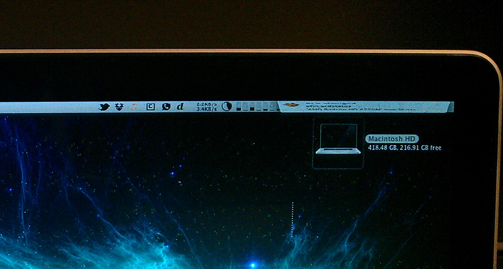

The following is a record of the problems I encountered with my MacBook Pro (Early 2011) beginning in late August and hopefully culminating in a once-again functional laptop. I'm making an effort to document all of the steps I took in attempting to rectify the situation including my experience with the Apple Retail Store. I've had great experiences with the repair team at Apple Stores in the past and I hope this will continue the trend.

* **MacBook Pro** (Early 2011, MacbookPro8,2) - Purchased April 29, 2011
* **Processor:** 2.2GHz Quad-Core Intel Core i7
* **Memory:** 4GB 1333MHz DDR3 SDRAM (2x2GB)
* **Storage:** 500GB Serial ATA Drive @ 7200rpm
* **Display:** 15" High-Resolution Glossy Widescreen Display (1680x1050)
* **Graphics:** AMD Radeon HD 6750M 1GB

I manually upgraded the memory to 8GB of Corsair 1333MHz DDR3 SDRAM (2x4GB) two months after getting the laptop to help improve gaming performance. The RAM has been fully functional with no indication of problems. The operating system was upgraded to 10.7 "Lion" and then 10.8 "Mountain Lion" on the launch day of each OS X release without any errors. There have been no indications of hard drive problems. The computer is only "lightly" utilized now as my work computer since [My Hackintosh](http://www.csullender.com/blog/2012/02/12/the-hackintosh/ "The Hackintosh") became my default gaming rig. The lone Thunderbolt port is used to power a 24" 1080p external monitor via a Thunderbolt to HDMI converter. The laptop was upgraded to 10.8.1 on August 24th and was working wonderfully until two days later... 

# August 29

I come into work in the morning and notice that my computer is running very hot (to the touch) with the fans spinning accordingly. I normally leave my computer at the login screen with the lid closed so I was a little confused about why it would be doing anything but sleeping. I open the computer and encounter a frozen login window. This happens every now and then so I just hard restart the computer via the power button. The computer starts up normally and runs fine for several hours until it freezes in the middle of displaying a [Notification Center](http://www.apple.com/osx/whats-new/features.html#notification) bubble. At first I thought it was just a random freeze or something but then noticed that the mouse icon was strangely still capable of being moved and very weirdly glitched (click for larger view). After attempted to click on stuff unsuccessfully and hearing the fans ramp up after several minutes I opted to once again perform a hard restart.



At this point I started to think that there was something wrong with my computer. Freezing is one thing, but in my experience, any weird graphical glitches tend to indicate problems with the GPU, which are extremely expensive to fix since they're built into the logic board. My previous MacBook Pro also experienced a GPU failure back during the NVIDIA recall so it fortunately was free to get fixed. The computer successfully started up and seemed to be working fine for the rest of the day, at which point I shut it down.

# August 30

I already had [gfxCardStatus](http://codykrieger.com/gfxCardStatus) installed on my laptop for manually swapping between the discrete and integrated graphics so I decided to try to test whether it was the discrete unit that was failing. About 50% of the time when I attempted to swap to the "integrated" graphics only, the computer would freeze and require a hard restart. If I got the graphics to the integrated setting successfully, then the computer would work fine without any problems (except incapable of powering my external monitor).

I decided to try reinstalling the operating system to see if somehow some vital files had been messed up and were the cause of the problems. I used the [recovery partition](http://support.apple.com/kb/HT4718) that Mountain Lion installs to perform a complete wipe on my hard drive and reinstalled the OS without any problems. Unfortunately the problems with the display still persisted as the computer randomly froze whenever the discrete unit was activated. I used the website http://ro.me/ to test the stability since as a Google Chrome Experiment that uses WebGL, it would require the discrete unit to be activated in order to properly render the website. Unfortunately visiting the website immediately resulted in the computer freezing as the discrete unit failed to properly activate.



I decided then to test what happens when I plugged in my external monitor when the system had been manually set to only the integrated graphics. As expected, the integrated Intel graphics were incapable of powering the external display. I then swapped the system back to the dynamic GPU switching mode and several things happened. The external screen correctly displayed my extended desktop except it was considerably darker than it should have been. After several seconds the external screen lost its signal and then my laptop screen started glitching and shut off. After yet another hard restart that resulted in the computer freezing during mid-boot, I decided to just give up and shut the computer down.

# August 31

The laptop can no longer successfully boot into the operating system. It either freezes prior to reaching the Apple logo during the boot sequence or just right before the desktop _should_ show up. I can still boot up on the recovery partition but none of the disk utilities are of any help. The [Apple Hardware Test](http://support.apple.com/kb/HT1509) can also be reached but does not indicate that there are any problems with the computer. As far as I can tell, the computer has no idea that the GPU is failing/has failed. I see no option other than taking the laptop into the Apple Store for maintenance. 

# September 2:

I went to the Apple store with a pre-scheduled Genius Bar appointment to examine my currently dead laptop. As usual the Geniuses always seem to assume that everyone has absolutely no knowledge about computers whatsoever, which is incredibly annoying/condescending. I described the problems I was experiencing and that I thought the GPU was dead, at which point the Genius immediately agreed and then ran a quick diagnostic that (still) indicated everything was working fine. He then said that since I am out of warranty and didn't buy Apple Care that I will need to pay $310 dollars to have the logic board replaced at one of their repair facilities (takes about a week). I don't understand how the graphics unit in what is supposed to be a "professional" grade laptop can fail in less than 1 year and 4 months. That type of lifespan is comparable to that of the shittiest of PCs. There is clearly a problem with the GPU, which should be AMD's problem, or the laptop isn't cooling it properly, which is Apple's problem. This will be my 2nd GPU failure and 3rd logic board replacement I'll have to get in a MacBook Pro in under three years, which I find completely unacceptable for how much Apple's products cost and the quality they claim (and used) to possess. I didn't submit the computer for a repair since I may try to use the [extended warranty offered by the credit card](https://www.americanexpress.com/us/content/card-benefits/extended-warranty.html) used to purchase the computer to offset the expense. This whole experience has really made me quite frustrated with Apple. If the competitors' products weren't so inferior I would seriously consider jumping ship and just running a Hackintosh laptop.

# September 3

As I mentioned above, I had learned about the extended warranty that many credit card companies offer on purchases made using their cards. This particular laptop was purchased using an American Express card and therefore qualifies for the [Extended Warranty](https://www.americanexpress.com/us/content/card-benefits/extended-warranty.html) offered by AMEX.

The warranty basically extends the original manufacturers warranty by one year, which effectively means that Apple computer purchases can have two years of the full warranty without any additional purchases of AppleCare or insurance. I've filed a claim for the repair costs of the computer which hopefully will be awarded within the next few days. If this manages to pan out, I will be beyond happy not having to pay $310 to get my laptop fixed.

# September 5

AMEX Assurance contacted me today and requested some paperwork proving the purchase of the laptop and the repair invoice prepared by the Apple Store from the other day. Hopefully this paperwork makes it through the claims process quickly so I can get my laptop back up and running.

# September 23

AMEX Assurance approved the extended warranty claim and has credited my account for the cost of the Apple Store repair! I dropped my laptop off at the Apple Store today for it to be sent off to their repair facility (for about a week). I'm stoked that this actually worked and didn't cost me anything except being without my laptop for a month (finally used my iPad for something haha). Hopefully everything comes back fully functional!

# September 29

I got my laptop back today and everything seems to be fully functional! Apple never explicitly diagnosed a problem since they just replaced everything inside the computer (Logic board, hard drive, RAM, and some connector wires) so it's like I have a brand new computer in terms of usage. Hopefully it lasts a little longer than its predecessor.