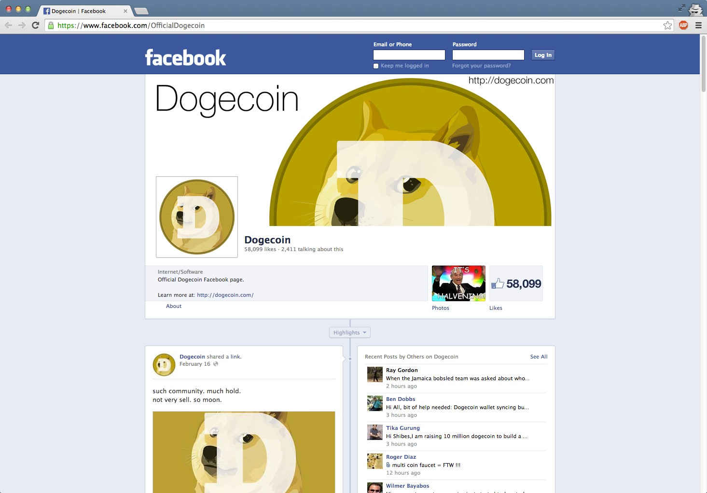
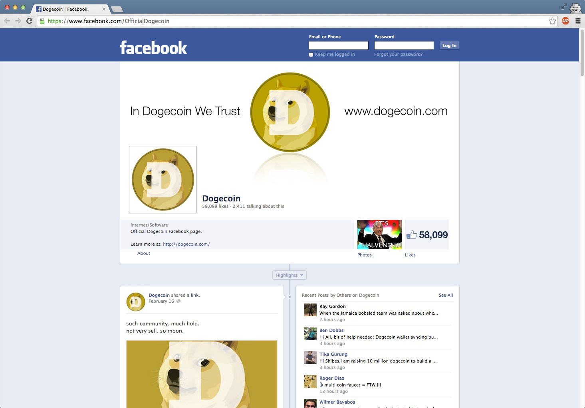

I made a few [Dogecoin](http://dogecoin.com/)\-themed Facebook timeline cover images during [a contest on Reddit](http://www.reddit.com/r/dogecoin/comments/1y8bul/fb_cover_photo_all_shibes_should_update_30/) last week. I wanted to create more minimalistic images rather than the extremely busy/stylized images other contestants were presenting. I also wanted to steer away from the Comic Sans MS and [Doge-speak](http://knowyourmeme.com/memes/doge) in favor of a more serious look. The resulting images are displayed below along with a Facebook demo and anyone is welcome to use them on Facebook (or elsewhere) to show their support for Dogecoin. To the Moon!

This cover image is based on the fantastic [Jamaican Bobsled + Dogecoin illustration](http://www.reddit.com/r/dogecoin/comments/1w87wh/i_finished_too_late_for_the_photoshibe_contest_so/) by [/u/intisun](http://www.reddit.com/user/intisun).

Tips: [DHEMz9TM6TpavqKP53trfVjxyF4fqPcC5k](dogecoin:DHEMz9TM6TpavqKP53trfVjxyF4fqPcC5k)