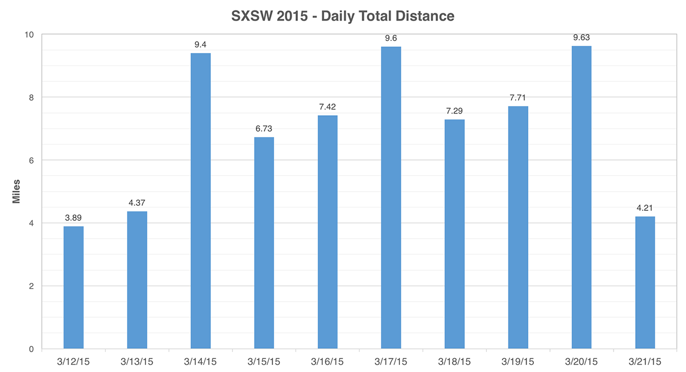

Another year, another South By, another week of extensive walking and partaking in free parties and concerts. SXSW 2015 has truly turned Austin into a spring break for mid 20-year-olds. As usual, I always go in with zero expectations and just tried to have a good time.

The first big event was on Saturday at [Amy Poehler's Smart Girls Party](http://family.do512.com/smartgirlsparty) at Banger's Sausage House and Beer Garden which was also where [Geek & Sundry](https://www.youtube.com/user/geekandsundry) and [Tabletop](https://www.youtube.com/playlist?list=PL7atuZxmT956cWFGxqSyRdn6GWhBxiAwE) had all-day events.

On Sunday we went to the [Cisco Girls in Tech](https://www.facebook.com/GirlsInTechAustin) launch party for the Austin chapter at the new downtown Gourdough's Public House.

On Monday was the [Google Local Guides](http://www.google.com/local/guides/) party at the downtown [Google Fiber Space](https://fiber.google.com/cities/austin/fiberspace/). The highlight of the night was definitely Google Maps Pegman pins that came in a variety of different designs. I got a Darth Vader, Gandalf, and Nyan Cat!

After the Google party, we went over to Empire Control Room and Garage where there was [an all-day concert series](https://www.facebook.com/events/1442314856060412/). We caught the end of Whiskey Shivers' set and then saw Marmalakes and Mother Falcon. During the last band's performance, I realized I was standing next to [Bob Boilen](http://www.npr.org/people/2100252/bob-boilen), the host of NPR's [Tiny Desk Concerts](http://www.npr.org/series/tiny-desk-concerts/).

On Tuesday I went to [Nerd Nite](http://austin.nerdnite.com/) at North Door sponsored by National Geographic. The evening was split into two parts: A special premiere of Neil deGrasse Tyson's new talk show [StarTalk TV](http://www.startalkradio.net/announcing-startalk-tv-national-geographic-premiere-date-and-episode-schedule/) (premiering on Nat Geo in April) and then a normal Nerd Nite. After we watched the screening, which NDT himself hasn't seen yet, the audience got to have a Skype Q&A session with him! It wasn't my first time _seeing_ him speak but it was still quite entertaining. The Nerd Nite event consisted of three talks that were loosely related to some Nat Geo shows. They covered topics such as the future of space telescopes, working as a digital nomad, and Thomas Jefferson's peddling in science. There was also a short, two-round trivia contest that my team won! By the end of the night, the entire audience was quite inebriated since there was an open bar (thanks National Geographic!).

Wednesday night was a little more low-key since we only attended [Republic Records' Class of 2015 showcase](http://2015.do512.com/republicsxdayone2015) down on South Congress. There we saw Jamestown Revival and MisterWives, the latter of which I bet will be getting some attention this year. I always (quickly) came to the realization that coconut water should never, ever be used in lemonade. Ew.

Thursday night began three consecutive afternoons/nights of hanging out at [Rachael Ray's Feedback House Party](http://www.rachaelray.com/tag/feedback2015) down on E. Cesar Chavez. Once again, I managed to get myself and a ton of friends access to this fantastic event. It's relatively small, in a great venue, has free food and drinks, and a continuous stream of bands. For the second year in a row I've opted to just stay here all day rather than wait in lines elsewhere. As usual, Blue Moon was the beer sponsor for both this event and the big Stubb's BBQ party. I was particularly fond of their [Cinnamon Horchata Ale](http://www.bluemoonbrewingcompany.com/OurBeers/Product/cinnamon-horchata), which managed to balance the horchata flavor without going overboard on the spices. Food was prepared on King Hawaiian rolls using a variety of Rachael Ray's own recipes for filler, so I got pretty comfortable stuffing myself full. I also had my random celebrity encounter of the festival (aside from Rachael Ray) when I chatted with the bassist from Green Day.

By time Sunday rolled around I was utterly exhausted from eight consecutive days of walking everywhere, listening to loud music, and eating free food and drinks. By my rough estimate, I only spent about $20 the entire time I was out for SXSW. So thanks random companies for all the free stuff! I've certainly gotten my fair share over the past several years. No SXSW retrospective of mine would be complete without my Fitbit step tally. Last year I managed to accrue a total of 162,434 steps (78.35 miles) and this year I fell a little short with only **145,682 steps (70.25 miles)**. The discrepancy is likely the result of me only really starting SXSW this year on Saturday rather than partaking in the Thursday night Startup Crawl.

Well, that's it! Until next year SX. If you want to see more pictures from SXSW, [check out my Flickr album](https://flic.kr/s/aHsk8Zs27J).