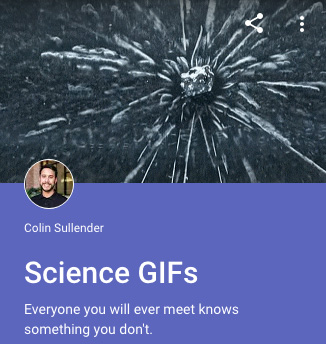

Three years ago, Google [announced](https://plus.google.com/+googleplus/posts/7ZpGWeou2sV) the Collections feature on the Google+ social network. It offered a way to group posts by topic so that others could follow their specific interests rather than [your entire profile](https://plus.google.com/+ColinSullender). I created two collections, [Data is Beautiful](https://plus.google.com/collection/MX98P) and [Science GIFs](https://plus.google.com/collection/A2NSc), the latter of which I've maintained for almost three years now. Every week I post a science-related GIF and an accompanying explanation of the finding, physical phenomenon, or chemical reaction. I try to feature recent research publications and announcements whenever possible to avoid reposting content seen elsewhere online.

Today the Science GIFs collection has almost 300,000 followers and my posts regularly trend on the platform. The collection has been [featured by Google+](https://plus.google.com/+googleplus/posts/bQWNt5dCE4X), got me invited into the [Google+ Create](https://plus.google.com/create) program, and even [listed as a resource](https://aapt.scitation.org/doi/abs/10.1119/1.4967909) in the AAPT's _The Physics Teacher_ academic journal. Unfortunately, Google+ offers extremely barebones analytics, so I've resorted to manually-updating a spreadsheet to track growth and viewership.

The different epochs of the Google+ ranking algorithm can be seen at each inflection point in the chart, with the most recent change happening in late December 2017. I'm fairly confident this was related to fighting bots and spam on the platform based on changes I saw in commenting behavior. This update also coincided with yet another drop in weekly view counts, leaving me with only 20-40k views per week. This is well below the 120-160k I regularly saw during the first half of 2017. Interestingly, comments and +1s remained relatively steady over the same period of time, which probably indicates even more personalization of the Google+ content algorithm.

Beyond the following I've built, making the weekly posts has been highly educational for me as a scientist and excellent practice for learning how to better communicate scientific concepts. I firmly believe scientists are obligated to disseminate knowledge to the general public and that social media and GIFs are effective tools for achieving that goal.