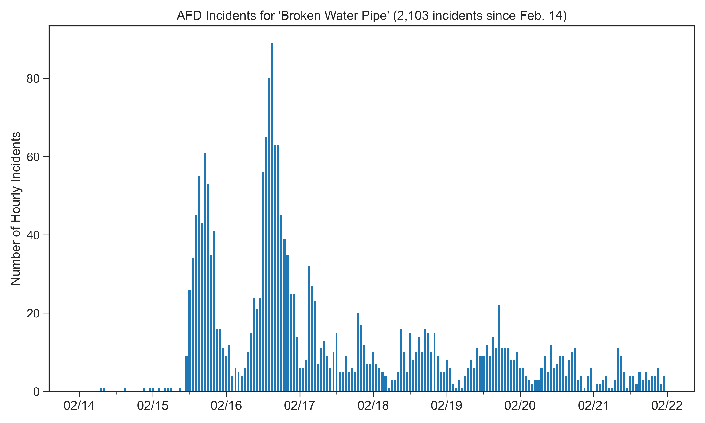
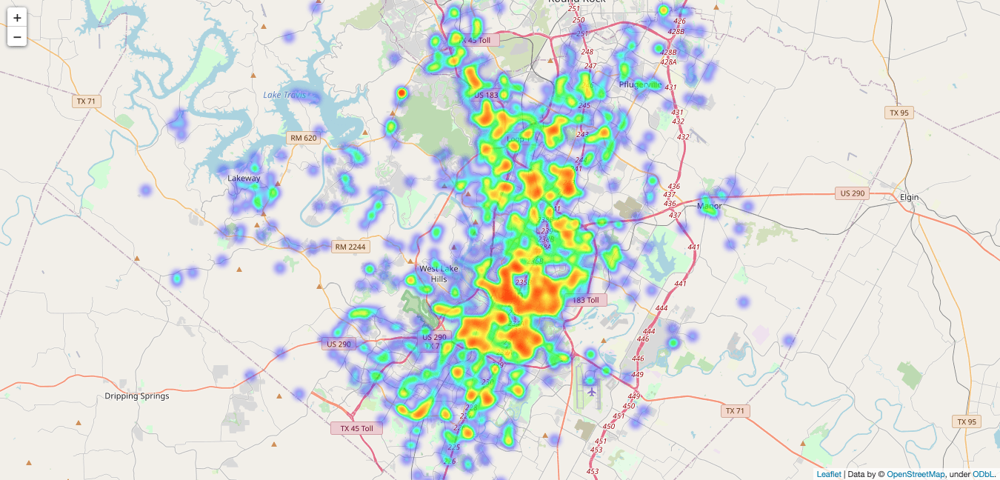
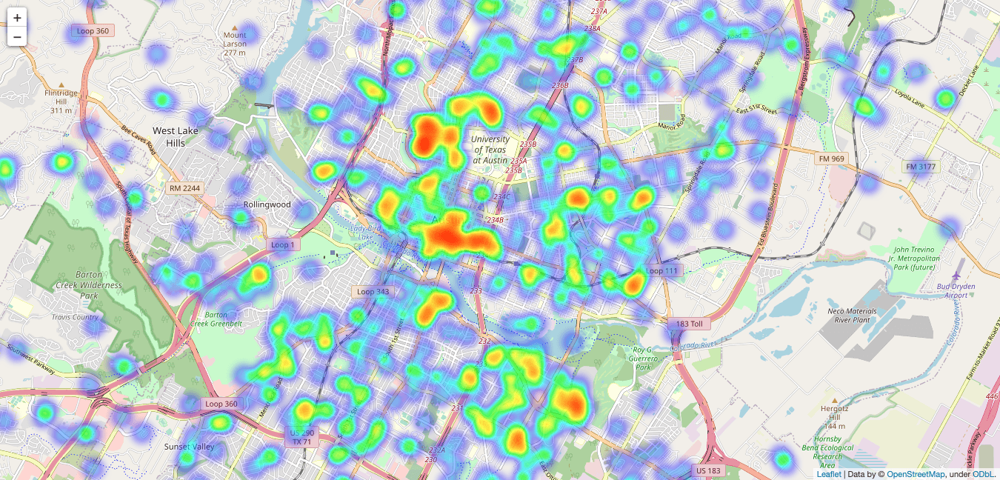
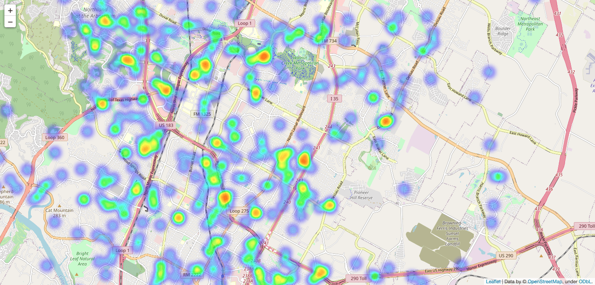
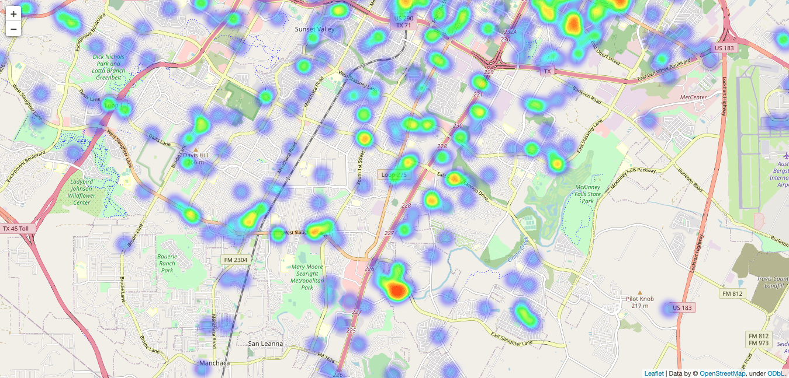

+++ 
draft = false
date = 2021-03-08T15:00:00-05:00
title = "Tracking Broken Water Pipes in Austin, TX"
tags = ['Austin', 'Data Visualization', 'Coding']
+++

A massive winter storm in February [disrupted power generation across the state of Texas](https://www.nytimes.com/interactive/2021/02/19/climate/texas-storm-power-generation-charts.html) and caused [nearly 3 million households to lose electricity](https://www.texastribune.org/2021/02/17/texas-winter-storm-power-outage-ercot/). As Austin Energy [struggled to implement rolling blackouts](https://www.statesman.com/story/weather/2021/02/15/austin-energy-begins-rolling-outages-across-city-ease-strain-power-grid/4487244001/) to reduce energy demand, many neighborhoods in the city went multiple days without electricity during [record-breaking cold weather](https://www.kxan.com/weather/weather-blog/cold-wave-surpasses-83-arctic-outbreak-enters-record-books/). With residents suddenly unable to heat their homes, Austin and Travis County emergency services [were flooded with calls about broken water pipes](https://www.statesman.com/story/news/2021/02/15/winter-storm-texas-hundreds-austin-report-broken-water-pipes-request-medical-services/6760606002/). By late afternoon on February 15th, the Austin Fire Department's [Active Fire Incidents](https://www.austintexas.gov/fact/default.cfm) page was filled with dozens of "BWP - Broken Water Pipe" incident reports.

Since this page only displays "active" incidents, I started tracking all unique reports in order to monitor the unfolding water pipe disaster. I also used a Twitter account that shares these reports ([@afdincidents](https://twitter.com/afdincidents)) to backfill data prior to the start of my own tracking.

### Incidents over Time

Between February 14 and 22, over 2,100 broken water pipe incidents were reported with the [AFD only able to respond to a fraction of these calls](https://twitter.com/AustinFireInfo/status/1361828649507332098). The majority of incidents were reported on February 15th and 16th as temperatures plummeted into the single digits (in Fahrenheit) overnight with a peak of almost **90 reports in a single hour**. As temperatures warmed to near freezing on February 17th, the report rate declined substantially despite power [ not being fully restored until several days later on February 21st](https://www.statesman.com/story/news/2021/02/21/austin-energy-power-back-100-percent-customers-after-ercot-shutdown/4536979001/).

### Localizing Incidents

Since the AFD incidents included exact addresses, I was able to localize the reports across the Austin area using the [Folium](https://python-visualization.github.io/folium/) Python module to generate heatmaps. In order to protect anonymity, I'm only sharing zoomed out screenshots rather than the full interactive map that contains specific addresses.

Here's an overview of the entire Austin area:

Zoomed in on Central Austin, where you'll notice the University of Texas escaped largely unscathed while the surrounding neighborhoods experienced some of most broken water pipe incidents:

Zoomed in on North Austin:

Zoomed in on South Austin:

Finally, I aggregated the incident reports by ZIP code to create this interactive choropleth map:



The ZIP code with the most incidents was 78759 located along US 183 and west of Mopac in northwest Austin. It's difficult to say why exactly this region was hit so hard, but it could be a combination of a lack of critical infrastructure that resulted in longer blackouts and newer home/apartment construction of potentially questionable quality.