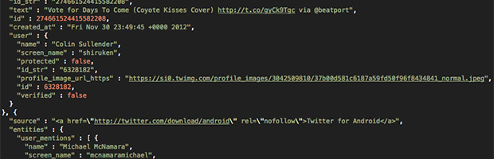
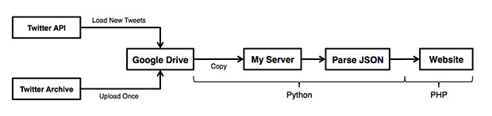

A couple years ago I made a simple Twitter Stats page to depict my tweeting activity. It was originally powered by some datasets pulled from [TweetStats](http://www.tweetstats.com/ "Visit Tweetstats") but I eventually upgraded it to run entirely from my own server. It was extremely barebones and grabbed my [Twitter](https://twitter.com/shiruken "View My Twitter") feed every hour and downloaded all the tweets that had been added since the previous update. Unfortunately, because Twitter does not offer the entire tweeting history via the website or this XML feed, I was missing well over a year of data. Combined with problems accessing this feed, I would regularly lose my entire (local) cache of my Twitter feed and have to spend a lot of time fixing everything. I eventually just decided to kill off the page since I was losing more and more of the older tweets every time I had to fix the cache and Twitter was changing the way the feed was presented.

Fast forward to December 2012, [Twitter announces the archive](http://blog.twitter.com/2012/12/your-twitter-archive.html) feature on the website. This allows you to download your _entire_ tweeting history in a .ZIP file for display as a HTML website. The actual tweet data is stored in easily readable JSON files contained within the archive. The files are separated by month and contain every single tweet and retweet since the creation of your account. This makes it extremely easy to parse through everything and generate whatever statistics you want. Upon hearing this announcement, I decided to revive my Twitter Stats page and use the Twitter archive to power it. Unfortunately, the Twitter API does not offer a means to regularly generate this archive. The user has to go to their account settings page and manually request the download URL, which makes an automated analytics page essentially impossible.

A few days before I finally gained access to the Twitter Archive feature, [a Google Apps Script was released](http://mashe.hawksey.info/2013/01/sync-twitter-archive-with-google-drive/) to automatically update the Twitter archive with new tweets. The latest update to Google Drive actually allows for site publishing, which means that the entire archive can be hosted by Google. This eliminating the annoying initial hurdle of regularly updating the Twitter archive for generating the statistics page. Rather than having to do all of this on my own server, all I needed to do was pull the updated data files from my Google Drive. This meant I needed to figure out the [Google Drive SDK](https://developers.google.com/drive/) in order to access my Google hosted Twitter archive and grab the data.



I had previously used Python for my backend collection of tweets, so I decided to re-use some of my existing code for the new website. After fighting with the Google authentication system, I finally managed to load the data files from Google Drive and cache them to my server. Each file is then then parsed to extract the metrics I track: monthly tweeting, daily tweeting, hourly tweeting, recent tweeting, most mentioned users, most retweeted users, most commonly used words, and most commonly used hashtags. All of the relevant information is then cached in .XML files for easy access when generating the website with PHP. Unlike the previous iteration of the stats website, I opted to use [Google Charts Tools](https://developers.google.com/chart/) for generating all the graphs for display. The API has been massively upgraded and simplified since the last time I attempted to implement them, making it much more versatile than my old inefficient bar-plotting code. The front-end ~~Twitter Analytics webpage~~ (_Deprecated November 2015_) is generated with PHP and Javascript (for Google Charts) with several graphs and lists relaying the information pulled from the Twitter archive.

Unlike the original version, ~~Twitter Analytics~~ (_Deprecated November 2015_) represents the entirety of my tweeting activity since joining the social network back in May 2007 (I didn't really start using it until a year later). I now know every single word I've said in my 31k tweets and when I said them. I can see distributions of character counts and when I'm most active throughout the day. Even with all of the stuff I've already done, I'm sure there's tons of other cool metrics that (could|need to) be made. When have I said certain words over time? What words are commonly used in the same tweet? What is the "emotional status" depicted by my tweets over time? If I had location information enabled, I'm sure a map of likely location could even be produced (CREEPER STATUS OVER 9000). I haven't decided whether I'm going to post the code I wrote to generate all this since it's kinda ugly. It's nothing too complicated and really just the Google authentication is the hardest thing to get properly set up. If you want to have an always up-to-date version of your Twitter Archive, definitely check out [Martin Hawksey's Google App Script](http://mashe.hawksey.info/2013/01/sync-twitter-archive-with-google-drive/). It's really the core functionality of everything you've seen above and without it, I'd probably have had to write a ton more code to get everything running.

~~**Check it out:** **Twitter Analytics 2.0**~~ (_Deprecated November 2015_)