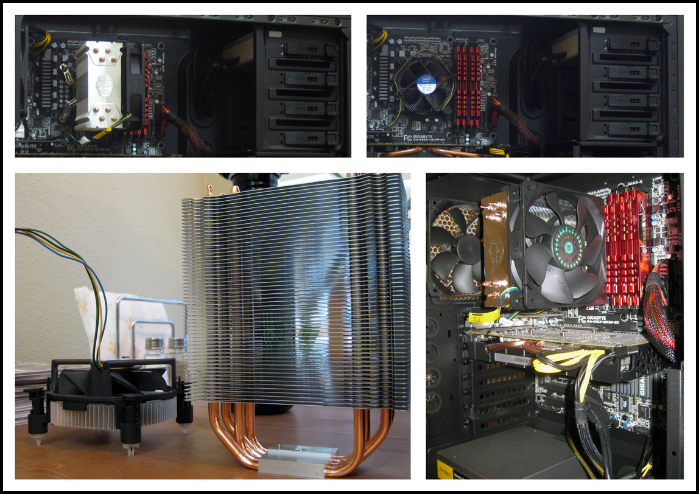

After about two months of using my new [Hackintosh](http://www.csullender.com/blog/2012/02/12/the-hackintosh/ "The Hackintosh") without any custom modifications, I decided I wanted to overclock my 3.3GHz [Intel Core i5-2500K](http://www.newegg.com/Product/Product.aspx?Item=N82E16819115072) processor a little bit to see if I would notice a performance increase. However, in order to do this, the horribly inadequate stock Intel CPU cooler needed to be replaced. After a brief search online, I settled on the [Cooler Master Hyper 212+](http://www.newegg.com/Product/Product.aspx?Item=N82E16835103065) as a suitable replacement for my CPU cooling needs. After an excruciating two-day wait, the part finally came in and I began the installation process of this gargantuan new cooling unit that just barely fit into my case. The new heatsink offered easily 10x more surface area for heat dissipation, which drastically increased the cooling efficiency of the running CPU. With the stock cooler, I saw the CPU idling around 45-50C. In stark contrast, the overclocked system now idles around 35C.

Overclocking was very straightforward for the "K" series Intel chips and followed several different guides I found on the [TonyMacx86 forums](http://www.tonymacx86.com/viewtopic.php?f=79&t=20136). I settled on a modest speed boost and increased the CPU frequency up to 4.2GHz from the stock 3.3GHz. After performing extensive stress tests to make sure that the CPU was being effectively cooled at the higher clock speeds with my new CPU cooler (the temperature never exceeded 60C), I ran some benchmarks on Geekbench to validate the performance increase.

As the Geekbench scores show, the overclocking resulted in a 23.8% increase in overall score. Most importantly, the overclocking up to 4.2GHz resulted in a 26% increase in processor integer and processor floating point performance scores. I've noticed a slight increase in responsiveness when working with many Google Chrome tabs but still have yet to judge the performance when playing an intensive videogame (too busy!).

