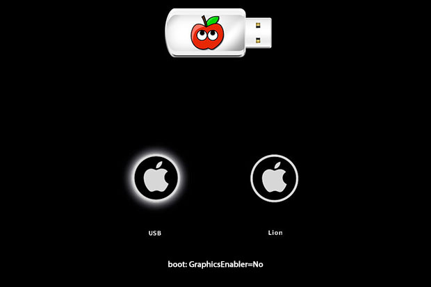

The release of the latest Apple computer operating system [OS X 10.8 'Mountain Lion'](http://www.apple.com/osx/) has been a [resounding success](http://www.engadget.com/2012/07/30/apple-reports-three-million-mountain-lion-downloads-in-four-days/) with over 3 million copies sold in less than four days. As with any system update, the Hackintosh community anxiously starts refreshing their favorite websites ([TonyMacx86](http://www.tonymacx86.com/home.php)) in hopes of reading tales of successful installations before attempting it themselves. After installing the $20 update onto my laptop, I finally decided to give it a whirl on [my Hackintosh.](http://www.csullender.com/blog/2012/02/12/the-hackintosh/ "The Hackintosh") I used the [Unibeast](http://www.tonymacx86.com/61-unibeast-1-5-install-os-x-mountain-lion-any-supported-intel-based-pc.html) tool from the aforementioned [TonyMacx86](http://www.tonymacx86.com/home.php) community to create a bootable flash drive with the Mountain Lion installer. A typical installation would then simply require booting off the flash drive, selecting the installation drive, and then enjoying the new OS. Unfortunately, my graphics card (ATI Radeon HD 6870) has had issues with the installation process and requires a few extra steps to get everything working. Without these additional modifications, the installer hangs at the launch screen indefinitely. This fix should work for any ATI Radeon 6XXX card but I have only tried it on the 6870.

First, you need to create the Mountain Lion installer drive using Unibeast according to [Step 2 of this guide](http://www.tonymacx86.com/61-unibeast-1-5-install-os-x-mountain-lion-any-supported-intel-based-pc.html). You'll need to make sure that your motherboard has the most recent BIOS firmware installed and the corresponding DSDT file is correctly installed in your `/Extras` folder. This is important because older firmwares may not correctly allow the USB drive to boot the computer. I had to upgrade my Gigabyte GA-Z68X-UD3H-B3 from F9 to F12 using the [Q-flash utility and a flash drive](http://www.youtube.com/watch?v=WmHStZPhR-Y).

Once you have the Mountain Lion installer created and the firmware on your motherboard up-to-date, you'll need to fiddle with one file related to the ATI graphics card to get everything working. Open up the Terminal app and enter the following two commands:

```
defaults write com.apple.finder AppleShowAllFiles 1
killall Finder
```

This will temporarily reveal all of the hidden files on your computer. Navigate to the USB drive with the Mountain Lion installer and go to the `System/Library/Extensions` folder. Locate the `ATI6000Controller.kext` file, **copy it to another location on your computer**, and then delete it from the flash drive. Be absolutely sure that you copied the file to a location you can access later on (like onto the installation USB drive). Enter the following commands in the Terminal app to re-hide the hidden files.

```
defaults write com.apple.finder AppleShowAllFiles 0
killall Finder
```

With your installer disk connected to your Hackintosh, restart and select the USB drive as the boot device from the BIOS splash-screen. Once the Chimera screen comes up, select the USB drive (arrow keys) and enter `GraphicsEnabler=No` to boot without using the graphics card hardware.




Hopefully you should be greeted by the Mountain Lion installation screen which you should proceed through like any other upgrade. The aspect ratio will probably be messed up as a result of not using the graphics card, but we'll fix this later. Once finished your Hackintosh will automatically restart and boot off of your normal drive rather than the USB installer. When the Chimera screen shows up, make sure that the drive you installed Mountain Lion on is selected and enter `GraphicsEnabler=No` once again to disable the use of the graphics card and allow the system to boot up.

As your computer boots into Mountain Lion for the first time it may report errors about incompatible files, lack of network and/or audio function, and have an incorrect screen resolution. Ignore all this for the time being. Move the `ATI6000Controller.kext` file you copied earlier to your Desktop and run [KextBeast](http://tonymacx86.blogspot.com/2010/08/kextbeast-simple-kext-installer.html) to install it to the correct location (You will need to change the Gatekeeper settings in the Security Pref Pane to allow for applications downloaded from 'Anywhere'). Restart your computer and this time do nothing at the Chimera screen. Your Hackintosh should boot normally and have the correct aspect ratio. At this point you'll want to run [MultiBeast](http://tonymacx86.blogspot.com/2010/02/multibeast-ultimate-post-installation.html) to fix any non-functional system functions (network, sound, 3rd-party drives, etc.). You'll probably also want to select the Repair Permissions option to make sure that everything is correctly installed. If everything went as planned, then you should have a fully functional Hackintosh running OS X 10.8 Mountain Lion! Enjoy!