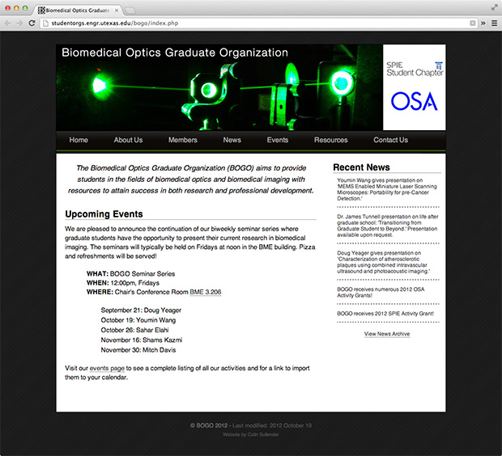

One of the student groups I'm involved in at the University of Texas is the [Biomedical Optics Graduate Organization](http://studentorgs.engr.utexas.edu/bogo "BOGO Website") (BOGO). We've recently had some changes in the leadership and I'm now the Treasurer for the group. One of the tasks I decided to undertake was an updated website that keeps better track of our upcoming events as well as helping members announce their publications and achievements. Unfortunately the webspace we're provided by UT is very limited and pretty much can only allow for static webpages (sadly cannot use Wordpress). I spent a few hours throwing together the new design and making it as _easy_ as possible for future updating of content. Fortunately PHP is available so some of the more frustrating things to update (i.e. the list of members displayed in a table) can be automatically generated from a list of the users. I've also opted to use Google Calendar and Google Drive to provide functionality on the website in the form of our future events list and contact form. We've had some trouble in the past with incoming emails getting lost in our mailing list, so hopefully the new contact options will help alleviate that.

So if you're into biomedical optical imaging (or just biomedical imaging) then you should check out the website to keep up to date on our upcoming seminars and events.

[Visit BOGO](http://studentorgs.engr.utexas.edu/bogo/index.php "Visit BOGO's Website")