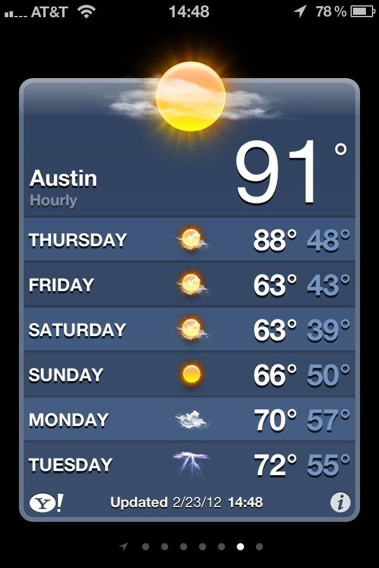

This past week has had some absolutely incredible weather, mostly in the upper 70's and mid 80's, but Thursday it decided to dip up into the 90's. After four years of Seattle winters (aka cloudy, cold, and wet), maybe Texas winters aren't all that bad. Sadly it has already dropped back into the mid 60's for the weekend and we might get some thunderstorms early next week. But it's still brilliantly sunny and hopefully indicative of the weather for the next few months. Now if only there was a way to escape the inevitable Texas summer heat.

