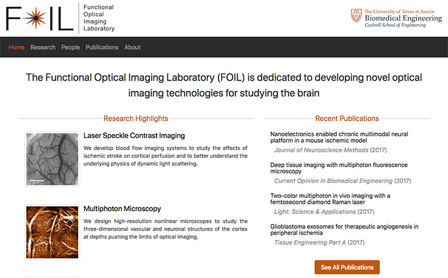

Add me on [LinkedIn](https://www.linkedin.com/in/csullender) and [GitHub](https://github.com/shiruken/). Check out my [coding projects](/coding).

# Reddit r/science (2015 - Current)

[reddit.com/r/science](https://www.reddit.com/r/science/)

The r/science community on Reddit is the largest science discussion platform on the internet with over 23 million subscribers and tens of millions of monthly pageviews. As a lead moderator of this subreddit, I help establish community policy and guide scientific discourse. Our [Ask Me Anything](https://www.reddit.com/r/science/search?q=flair%3AAMA&sort=top&restrict_sr=on&t=all) and [Science Discussion](https://www.reddit.com/r/science/search?q=flair:Discussion&restrict_sr=on&sort=new&t=all) series have hosted hundreds of scientists, engineers, doctors, and other experts to discuss their current work with a more general audience. Some of our most popular guests have included [Stephen Hawking](https://www.reddit.com/r/science/comments/3nyn5i/science_ama_series_stephen_hawking_ama_answers/), [George Church](https://www.reddit.com/r/science/comments/4fbcyv/science_ama_series_im_george_church_professor_at/), [Jennifer Doudna](https://www.reddit.com/r/science/comments/7r9pgw/hi_were_here_to_talk_about_all_things_crispr_and/), and numerous members of [NASA](https://www.reddit.com/r/science/search/?q=flair%3ANASA&restrict_sr=1&sort=top), ESA, [NOAA](https://www.reddit.com/r/science/search/?q=flair%3ANOAA&restrict_sr=1&sort=top), and NIH.

Behind the scenes, I implemented a comprehensive tracking system using the Reddit API in order to better understand the dynamics and reach of our content, optimize automated moderation practices, and to guide future decision making for the subreddit. I also designed the current branding and style used by the desktop website.

# Functional Optical Imaging Laboratory (2014 - Current)

[foil.bme.utexas.edu](https://foil.bme.utexas.edu/)

I helped develop and currently maintain the website for my academic research lab at the University of Texas at Austin. We wanted a platform that did not require editing raw HTML in order to update content such as member lists and publications. The website was built using [Django](https://www.djangoproject.com/) and [Bootstrap](https://getbootstrap.com/) to be fully responsive across a variety of devices.

# Google+ 'Science GIFs' Collection (2015 - 2018)

[~~https://plus.google.com/collection/A2NSc~~](https://plus.google.com/collection/A2NSc "View the Science GIFs collection (Inaccessible)")

[https://sciencegifs.csullender.com/](https://sciencegifs.csullender.com/ "View archive of the content from the Science GIFs collection")

I created and maintained the 'Science GIFs' collection on Google+. It was one of the largest and most active science-focused collections on the social network and [garnered over 320,000 followers]( "View 'Three Years of 'Science GIFs' on Google+' blog entry") prior to the shuttering of the Google+ platform. The collection featured weekly posts explaining phenomena depicted in short animated GIFs gathered from various sources across the internet. The success of this collection resulted in an invitation to the Google+ Create program, which highlighted quality content on the platform.

# Biomedical Optics Graduate Organization (2012 - 2015)

I designed, developed, and maintained the website for the Biomedical Optics Graduate Organization (BOGO) at the University of Texas at Austin. The website was a combination of PHP and HTML and provided basic information about the student organization such as new, upcoming events, and academic resources. The website was discontinued alongside the university's hosting services in 2015.

# Treeskunk Productions (2006 - 2014)

~~treeskunk.com~~

[YouTube Channel](https://www.youtube.com/user/TreeskunkProductions)

I designed, developed, and maintained the official website (WordPress) and forums (phpBB) for the Treeskunk Productions [machinima](https://en.wikipedia.org/wiki/Machinima) community. I was responsible for storyline and script editing, puppeteering, title animations, post-production, and online distribution of videos across various social networks including YouTube, Vimeo, Facebook, and Twitter. We were formerly Machinima.com partners with over 3 million views and 2,000+ YouTube channel subscribers.

# Freelance Web Development (2006 - 2011)

I created and deployed Wordpress and VBulletin themes and static website designs for small businesses and video game groups. I also created custom graphics including logos, wallpapers, avatars, and signatures.

# ForgeHub (2007)

[forgehub.com](https://www.forgehub.com/)

I created the original branding and logo for this website and helped advise the founders during its launch.

# GamingTV (2006 - 2008)

~~gamingtv.us~~

I was a founder, website developer, and editor for this video game website focused on aggregating and rating original machinima.

# Cerberus Productions (2005 - 2006)

I was a founder and primary developer for this short-lived Halo 2 machinima production company. I wrote scripts, puppeteered, recorded, and edited several short videos.

# Digital Origins (2005 - 2006)

I was a developer, content producer, and affiliate for this short-lived video game fan website.

# HaloTV (2005 - 2006)

~~halotv.net~~

[Video Archive](/halotv)

I was an administrator and graphic designer helping with the relaunch of this popular [Halo](https://halo.bungie.net/projects/halouniverse.aspx) fan website and forum. We hosted hundreds of Halo-related videos including montages, original machinima series ([Red vs. Blue](https://roosterteeth.com/series/red-vs-blue), [The Codex](https://www.halopedia.org/The_Codex), [Fire Team Charlie](http://halo.wikia.com/wiki/Fire_Team_Charlie_(machinima)), etc.), speedruns, and early tournament broadcasts.

# Halo Machinima (2005)

I was a graphic designer on this website dedicated to Halo machinima.